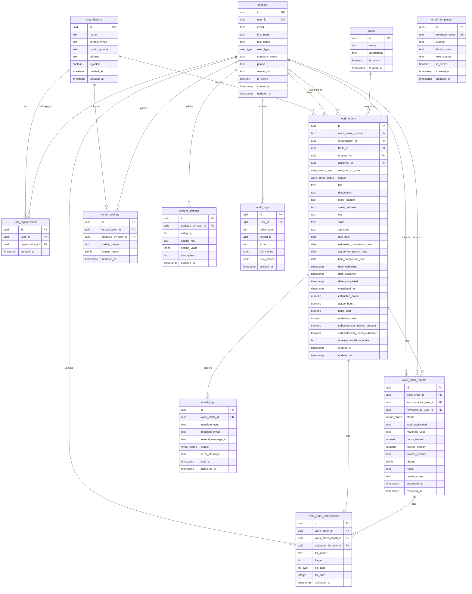

# WorkOrderPro Database Schema Documentation

## Executive Summary

WorkOrderPro uses a comprehensive 12-table PostgreSQL database with Row Level Security (RLS) to manage construction work orders across three user types: Admins, Partners, and Subcontractors. The schema supports work order lifecycle management, user organization relationships, reporting, email notifications, and comprehensive audit logging.

## Database Architecture Overview

### Core Tables (12)
1. **organizations** - Company/organization information
2. **user_organizations** - Many-to-many user-organization relationships
3. **profiles** - Extended user profile information
4. **trades** - Available trade skills (Plumbing, HVAC, etc.)
5. **work_orders** - Main work order records
6. **work_order_reports** - Subcontractor completion reports
7. **work_order_attachments** - File attachments for work orders and reports
8. **email_templates** - System email templates
9. **email_logs** - Email delivery tracking
10. **email_settings** - Email configuration per organization
11. **system_settings** - Global system configuration
12. **audit_logs** - Complete audit trail for all changes

### Custom Enums (6)
- `user_type`: 'admin', 'partner', 'subcontractor'
- `work_order_status`: 'received', 'assigned', 'in_progress', 'completed', 'cancelled'
- `assignment_type`: 'internal', 'subcontractor'
- `report_status`: 'submitted', 'reviewed', 'approved', 'rejected'
- `email_status`: 'sent', 'delivered', 'failed', 'bounced'
- `file_type`: 'photo', 'invoice', 'document'

## Entity Relationship Diagram



## Table Definitions

### 1. organizations
**Purpose**: Stores partner company information that submit work orders.

| Column | Type | Nullable | Default | Description |
|--------|------|----------|---------|-------------|
| id | uuid | No | gen_random_uuid() | Primary key |
| name | text | No | - | Organization name |
| contact_email | text | No | - | Primary contact email |
| contact_phone | text | Yes | - | Contact phone number |
| address | text | Yes | - | Organization address |
| is_active | boolean | No | true | Whether organization is active |
| created_at | timestamp | No | now() | Creation timestamp |
| updated_at | timestamp | No | now() | Last update timestamp |

**Indexes**:
- `idx_organizations_active` ON (is_active)
- `idx_organizations_contact_email` ON (contact_email)

### 2. user_organizations
**Purpose**: Junction table linking users to organizations (many-to-many relationship).

| Column | Type | Nullable | Default | Description |
|--------|------|----------|---------|-------------|
| id | uuid | No | gen_random_uuid() | Primary key |
| user_id | uuid | No | - | References profiles.id |
| organization_id | uuid | No | - | References organizations.id |
| created_at | timestamp | No | now() | Creation timestamp |

**Indexes**:
- `idx_user_organizations_user_id` ON (user_id)
- `idx_user_organizations_org_id` ON (organization_id)

### 3. profiles
**Purpose**: Extended user profile information beyond Supabase Auth.

| Column | Type | Nullable | Default | Description |
|--------|------|----------|---------|-------------|
| id | uuid | No | gen_random_uuid() | Primary key |
| user_id | uuid | No | - | References auth.users.id |
| email | text | No | - | User email address |
| first_name | text | No | - | User first name |
| last_name | text | No | - | User last name |
| user_type | user_type | No | 'subcontractor' | User type enum |
| company_name | text | Yes | - | Company name for subcontractors |
| phone | text | Yes | - | Phone number |
| avatar_url | text | Yes | - | Profile picture URL |
| is_active | boolean | No | true | Whether user is active |
| created_at | timestamp | No | now() | Creation timestamp |
| updated_at | timestamp | No | now() | Last update timestamp |

**Indexes**:
- `idx_profiles_user_id` ON (user_id)
- `idx_profiles_user_type` ON (user_type)
- `idx_profiles_email` ON (email)

### 4. trades
**Purpose**: Available trade skills and categories for work orders.

| Column | Type | Nullable | Default | Description |
|--------|------|----------|---------|-------------|
| id | uuid | No | gen_random_uuid() | Primary key |
| name | text | No | - | Trade name (e.g., "Plumbing", "HVAC") |
| description | text | Yes | - | Trade description |
| is_active | boolean | No | true | Whether trade is available |
| created_at | timestamp | No | now() | Creation timestamp |

**Indexes**:
- `idx_trades_active` ON (is_active)

### 5. work_orders
**Purpose**: Main work order records with complete lifecycle tracking.

| Column | Type | Nullable | Default | Description |
|--------|------|----------|---------|-------------|
| id | uuid | No | gen_random_uuid() | Primary key |
| work_order_number | text | Yes | - | Auto-generated work order number |
| organization_id | uuid | Yes | - | References organizations.id |
| trade_id | uuid | Yes | - | References trades.id |
| created_by | uuid | No | - | References profiles.id |
| assigned_to | uuid | Yes | - | References profiles.id |
| assigned_to_type | assignment_type | Yes | - | 'internal' or 'subcontractor' |
| status | work_order_status | No | 'received' | Current status |
| title | text | No | - | Work order title |
| description | text | Yes | - | Detailed description |
| store_location | text | Yes | - | Store/location identifier |
| street_address | text | Yes | - | Street address |
| city | text | Yes | - | City |
| state | text | Yes | - | State |
| zip_code | text | Yes | - | ZIP code |
| due_date | date | Yes | - | Due date |
| estimated_completion_date | date | Yes | - | Estimated completion |
| actual_completion_date | date | Yes | - | Actual completion |
| final_completion_date | date | Yes | - | Final completion |
| date_submitted | timestamp | No | now() | Submission timestamp |
| date_assigned | timestamp | Yes | - | Assignment timestamp |
| date_completed | timestamp | Yes | - | Completion timestamp |
| completed_at | timestamp | Yes | - | Completion timestamp |
| estimated_hours | numeric | Yes | - | Estimated work hours |
| actual_hours | numeric | Yes | - | Actual work hours |
| labor_cost | numeric | Yes | - | Labor cost |
| materials_cost | numeric | Yes | - | Materials cost |
| subcontractor_invoice_amount | numeric | Yes | - | Subcontractor invoice amount |
| subcontractor_report_submitted | boolean | Yes | false | Whether report submitted |
| admin_completion_notes | text | Yes | - | Admin completion notes |
| created_at | timestamp | No | now() | Creation timestamp |
| updated_at | timestamp | No | now() | Last update timestamp |

**Indexes**:
- `idx_work_orders_organization_status` ON (organization_id, status)
- `idx_work_orders_assigned_status` ON (assigned_to, status)
- `idx_work_orders_trade` ON (trade_id)
- `idx_work_orders_created_by` ON (created_by)

### 6. work_order_reports
**Purpose**: Subcontractor completion reports with review workflow.

| Column | Type | Nullable | Default | Description |
|--------|------|----------|---------|-------------|
| id | uuid | No | gen_random_uuid() | Primary key |
| work_order_id | uuid | No | - | References work_orders.id |
| subcontractor_user_id | uuid | No | - | References profiles.id |
| reviewed_by_user_id | uuid | Yes | - | References profiles.id |
| status | report_status | No | 'submitted' | Report status |
| work_performed | text | No | - | Description of work performed |
| materials_used | text | Yes | - | Materials used |
| hours_worked | numeric | Yes | - | Hours worked |
| invoice_amount | numeric | No | - | Invoice amount |
| invoice_number | text | Yes | - | Invoice number |
| photos | jsonb | Yes | - | Photo URLs |
| notes | text | Yes | - | Additional notes |
| review_notes | text | Yes | - | Review feedback |
| submitted_at | timestamp | No | now() | Submission timestamp |
| reviewed_at | timestamp | Yes | - | Review timestamp |

**Indexes**:
- `idx_work_order_reports_work_order` ON (work_order_id)
- `idx_work_order_reports_subcontractor` ON (subcontractor_user_id)
- `idx_work_order_reports_status` ON (status)

### 7. work_order_attachments
**Purpose**: File attachments for work orders and reports.

| Column | Type | Nullable | Default | Description |
|--------|------|----------|---------|-------------|
| id | uuid | No | gen_random_uuid() | Primary key |
| work_order_id | uuid | Yes | - | References work_orders.id |
| work_order_report_id | uuid | Yes | - | References work_order_reports.id |
| uploaded_by_user_id | uuid | No | - | References profiles.id |
| file_name | text | No | - | Original file name |
| file_url | text | No | - | Storage URL |
| file_type | file_type | No | - | File type enum |
| file_size | integer | Yes | - | File size in bytes |
| uploaded_at | timestamp | No | now() | Upload timestamp |

**Indexes**:
- `idx_work_order_attachments_work_order` ON (work_order_id)
- `idx_work_order_attachments_report` ON (work_order_report_id)
- `idx_work_order_attachments_uploader` ON (uploaded_by_user_id)

### 8. email_templates
**Purpose**: System email templates for notifications.

| Column | Type | Nullable | Default | Description |
|--------|------|----------|---------|-------------|
| id | uuid | No | gen_random_uuid() | Primary key |
| template_name | text | No | - | Unique template identifier |
| subject | text | No | - | Email subject |
| html_content | text | No | - | HTML email content |
| text_content | text | Yes | - | Plain text content |
| is_active | boolean | No | true | Whether template is active |
| created_at | timestamp | No | now() | Creation timestamp |
| updated_at | timestamp | No | now() | Last update timestamp |

### 9. email_logs
**Purpose**: Email delivery tracking and status.

| Column | Type | Nullable | Default | Description |
|--------|------|----------|---------|-------------|
| id | uuid | No | gen_random_uuid() | Primary key |
| work_order_id | uuid | Yes | - | References work_orders.id |
| template_used | text | Yes | - | Template name used |
| recipient_email | text | No | - | Recipient email |
| resend_message_id | text | Yes | - | Resend service message ID |
| status | email_status | No | 'sent' | Email status |
| error_message | text | Yes | - | Error message if failed |
| sent_at | timestamp | No | now() | Send timestamp |
| delivered_at | timestamp | Yes | - | Delivery timestamp |

**Indexes**:
- `idx_email_logs_work_order` ON (work_order_id)
- `idx_email_logs_status` ON (status)
- `idx_email_logs_sent_at` ON (sent_at)

### 10. email_settings
**Purpose**: Email configuration per organization.

| Column | Type | Nullable | Default | Description |
|--------|------|----------|---------|-------------|
| id | uuid | No | gen_random_uuid() | Primary key |
| organization_id | uuid | Yes | - | References organizations.id |
| updated_by_user_id | uuid | No | - | References profiles.id |
| setting_name | text | No | - | Setting identifier |
| setting_value | jsonb | No | - | Setting value |
| updated_at | timestamp | No | now() | Last update timestamp |

### 11. system_settings
**Purpose**: Global system configuration.

| Column | Type | Nullable | Default | Description |
|--------|------|----------|---------|-------------|
| id | uuid | No | gen_random_uuid() | Primary key |
| updated_by_user_id | uuid | No | - | References profiles.id |
| category | text | No | - | Setting category |
| setting_key | text | No | - | Setting key |
| setting_value | jsonb | No | - | Setting value |
| description | text | Yes | - | Setting description |
| updated_at | timestamp | No | now() | Last update timestamp |

### 12. audit_logs
**Purpose**: Complete audit trail for all system changes.

| Column | Type | Nullable | Default | Description |
|--------|------|----------|---------|-------------|
| id | uuid | No | gen_random_uuid() | Primary key |
| user_id | uuid | Yes | - | References profiles.id |
| table_name | text | No | - | Affected table |
| record_id | uuid | No | - | Affected record ID |
| action | text | No | - | Action performed |
| old_values | jsonb | Yes | - | Previous values |
| new_values | jsonb | Yes | - | New values |
| created_at | timestamp | No | now() | Action timestamp |

**Indexes**:
- `idx_audit_logs_table_record` ON (table_name, record_id)
- `idx_audit_logs_user` ON (user_id)
- `idx_audit_logs_created_at` ON (created_at)

## Database Functions

### 1. get_current_user_type()
**Purpose**: Returns the current user's type for RLS policies.
```sql
CREATE OR REPLACE FUNCTION public.get_current_user_type()
RETURNS user_type
LANGUAGE plpgsql
STABLE SECURITY DEFINER
AS $function$
BEGIN
  RETURN (
    SELECT user_type 
    FROM public.profiles 
    WHERE user_id = auth.uid()
    LIMIT 1
  );
END;
$function$
```

### 2. get_user_organizations()
**Purpose**: Returns organizations the current user belongs to.
```sql
CREATE OR REPLACE FUNCTION public.get_user_organizations()
RETURNS TABLE(organization_id uuid)
LANGUAGE plpgsql
STABLE SECURITY DEFINER
AS $function$
BEGIN
  RETURN QUERY
  SELECT uo.organization_id 
  FROM public.user_organizations uo
  JOIN public.profiles p ON p.id = uo.user_id
  WHERE p.user_id = auth.uid();
END;
$function$
```

### 3. is_admin()
**Purpose**: Checks if current user is an admin.
```sql
CREATE OR REPLACE FUNCTION public.is_admin()
RETURNS boolean
LANGUAGE plpgsql
STABLE SECURITY DEFINER
AS $function$
BEGIN
  RETURN public.get_current_user_type() = 'admin';
END;
$function$
```

### 4. user_belongs_to_organization()
**Purpose**: Checks if user belongs to specific organization.
```sql
CREATE OR REPLACE FUNCTION public.user_belongs_to_organization(org_id uuid)
RETURNS boolean
LANGUAGE plpgsql
STABLE SECURITY DEFINER
AS $function$
BEGIN
  RETURN EXISTS (
    SELECT 1 
    FROM public.get_user_organizations() 
    WHERE organization_id = org_id
  );
END;
$function$
```

### 5. user_assigned_to_work_order()
**Purpose**: Checks if user is assigned to specific work order.
```sql
CREATE OR REPLACE FUNCTION public.user_assigned_to_work_order(wo_id uuid)
RETURNS boolean
LANGUAGE plpgsql
STABLE SECURITY DEFINER
AS $function$
BEGIN
  RETURN EXISTS (
    SELECT 1 
    FROM public.work_orders wo
    JOIN public.profiles p ON p.id = wo.assigned_to
    WHERE wo.id = wo_id AND p.user_id = auth.uid()
  );
END;
$function$
```

### 6. generate_work_order_number()
**Purpose**: Generates unique work order numbers.
```sql
CREATE OR REPLACE FUNCTION public.generate_work_order_number()
RETURNS text
LANGUAGE plpgsql
AS $function$
DECLARE
  current_year TEXT;
  sequence_num INTEGER;
  work_order_num TEXT;
BEGIN
  current_year := EXTRACT(YEAR FROM now())::TEXT;
  
  SELECT COALESCE(MAX(
    CASE 
      WHEN work_order_number ~ ('^WO-' || current_year || '-[0-9]+$')
      THEN CAST(SUBSTRING(work_order_number FROM LENGTH('WO-' || current_year || '-') + 1) AS INTEGER)
      ELSE 0
    END
  ), 0) + 1
  INTO sequence_num
  FROM public.work_orders;
  
  work_order_num := 'WO-' || current_year || '-' || LPAD(sequence_num::TEXT, 4, '0');
  
  RETURN work_order_num;
END;
$function$
```

### 7. handle_new_user()
**Purpose**: Creates profile when new user signs up.
```sql
CREATE OR REPLACE FUNCTION public.handle_new_user()
RETURNS trigger
LANGUAGE plpgsql
SECURITY DEFINER
AS $function$
BEGIN
  INSERT INTO public.profiles (user_id, email, first_name, last_name)
  VALUES (
    NEW.id,
    NEW.email,
    COALESCE(NEW.raw_user_meta_data->>'first_name', 'User'),
    COALESCE(NEW.raw_user_meta_data->>'last_name', '')
  );
  RETURN NEW;
END;
$function$
```

### 8. update_updated_at_column()
**Purpose**: Trigger function to update updated_at timestamps.
```sql
CREATE OR REPLACE FUNCTION public.update_updated_at_column()
RETURNS trigger
LANGUAGE plpgsql
AS $function$
BEGIN
  NEW.updated_at = now();
  RETURN NEW;
END;
$function$
```

## Row Level Security (RLS) Policies

### organizations Table Policies

**1. Admins can manage all organizations**
```sql
CREATE POLICY "Admins can manage all organizations" ON public.organizations
FOR ALL TO authenticated
USING (is_admin())
WITH CHECK (is_admin());
```

**2. Partners can view their organizations**
```sql
CREATE POLICY "Partners can view their organizations" ON public.organizations
FOR SELECT TO authenticated
USING (
  (get_current_user_type() = 'partner'::user_type) AND 
  user_belongs_to_organization(id)
);
```

**3. Subcontractors can view organizations they work for**
```sql
CREATE POLICY "Subcontractors can view organizations they work for" ON public.organizations
FOR SELECT TO authenticated
USING (
  (get_current_user_type() = 'subcontractor'::user_type) AND 
  (id IN (
    SELECT DISTINCT wo.organization_id
    FROM work_orders wo
    JOIN profiles p ON p.id = wo.assigned_to
    WHERE p.user_id = auth.uid()
  ))
);
```

### user_organizations Table Policies

**1. Admins can manage all user organizations**
```sql
CREATE POLICY "Admins can manage all user organizations" ON public.user_organizations
FOR ALL TO authenticated
USING (is_admin())
WITH CHECK (is_admin());
```

**2. Partners can manage their organization relationships**
```sql
CREATE POLICY "Partners can manage their organization relationships" ON public.user_organizations
FOR ALL TO authenticated
USING (
  (get_current_user_type() = 'partner'::user_type) AND 
  user_belongs_to_organization(organization_id)
)
WITH CHECK (
  (get_current_user_type() = 'partner'::user_type) AND 
  user_belongs_to_organization(organization_id)
);
```

**3. Users can view their own organization relationships**
```sql
CREATE POLICY "Users can view their own organization relationships" ON public.user_organizations
FOR SELECT TO authenticated
USING (
  user_id IN (
    SELECT profiles.id
    FROM profiles
    WHERE profiles.user_id = auth.uid()
  )
);
```

### profiles Table Policies

**1. Admins can manage all profiles**
```sql
CREATE POLICY "Admins can manage all profiles" ON public.profiles
FOR ALL TO authenticated
USING (is_admin())
WITH CHECK (is_admin());
```

**2. Partners can view profiles in their organizations**
```sql
CREATE POLICY "Partners can view profiles in their organizations" ON public.profiles
FOR SELECT TO authenticated
USING (
  (get_current_user_type() = 'partner'::user_type) AND 
  (
    (user_id = auth.uid()) OR 
    (id IN (
      SELECT uo.user_id
      FROM user_organizations uo
      WHERE uo.organization_id IN (
        SELECT organization_id
        FROM get_user_organizations()
      )
    ))
  )
);
```

**3. Subcontractors can view all profiles**
```sql
CREATE POLICY "Subcontractors can view all profiles" ON public.profiles
FOR SELECT TO authenticated
USING (get_current_user_type() = 'subcontractor'::user_type);
```

**4. Users can update their own profile**
```sql
CREATE POLICY "Users can update their own profile" ON public.profiles
FOR UPDATE TO authenticated
USING (user_id = auth.uid())
WITH CHECK (user_id = auth.uid());
```

**5. Users can insert their own profile**
```sql
CREATE POLICY "Users can insert their own profile" ON public.profiles
FOR INSERT TO authenticated
WITH CHECK (user_id = auth.uid());
```

### trades Table Policies

**1. Admins can manage all trades**
```sql
CREATE POLICY "Admins can manage all trades" ON public.trades
FOR ALL TO authenticated
USING (is_admin())
WITH CHECK (is_admin());
```

**2. Partners and subcontractors can view trades**
```sql
CREATE POLICY "Partners and subcontractors can view trades" ON public.trades
FOR SELECT TO authenticated
USING (get_current_user_type() = ANY (ARRAY['partner'::user_type, 'subcontractor'::user_type]));
```

### work_orders Table Policies

**1. Admins can manage all work orders**
```sql
CREATE POLICY "Admins can manage all work orders" ON public.work_orders
FOR ALL TO authenticated
USING (is_admin())
WITH CHECK (is_admin());
```

**2. Partners can manage work orders in their organizations**
```sql
CREATE POLICY "Partners can manage work orders in their organizations" ON public.work_orders
FOR ALL TO authenticated
USING (
  (get_current_user_type() = 'partner'::user_type) AND 
  user_belongs_to_organization(organization_id)
)
WITH CHECK (
  (get_current_user_type() = 'partner'::user_type) AND 
  user_belongs_to_organization(organization_id)
);
```

**3. Subcontractors can view assigned work orders**
```sql
CREATE POLICY "Subcontractors can view assigned work orders" ON public.work_orders
FOR SELECT TO authenticated
USING (
  (get_current_user_type() = 'subcontractor'::user_type) AND 
  user_assigned_to_work_order(id)
);
```

### work_order_reports Table Policies

**1. Admins can manage all work order reports**
```sql
CREATE POLICY "Admins can manage all work order reports" ON public.work_order_reports
FOR ALL TO authenticated
USING (is_admin())
WITH CHECK (is_admin());
```

**2. Partners can view reports for their organization work orders**
```sql
CREATE POLICY "Partners can view reports for their organization work orders" ON public.work_order_reports
FOR SELECT TO authenticated
USING (
  (get_current_user_type() = 'partner'::user_type) AND 
  (work_order_id IN (
    SELECT wo.id
    FROM work_orders wo
    WHERE user_belongs_to_organization(wo.organization_id)
  ))
);
```

**3. Partners can review reports for their organization**
```sql
CREATE POLICY "Partners can review reports for their organization" ON public.work_order_reports
FOR UPDATE TO authenticated
USING (
  (get_current_user_type() = 'partner'::user_type) AND 
  (work_order_id IN (
    SELECT wo.id
    FROM work_orders wo
    WHERE user_belongs_to_organization(wo.organization_id)
  ))
)
WITH CHECK (
  (get_current_user_type() = 'partner'::user_type) AND 
  (work_order_id IN (
    SELECT wo.id
    FROM work_orders wo
    WHERE user_belongs_to_organization(wo.organization_id)
  ))
);
```

**4. Subcontractors can manage their own reports**
```sql
CREATE POLICY "Subcontractors can manage their own reports" ON public.work_order_reports
FOR ALL TO authenticated
USING (
  (get_current_user_type() = 'subcontractor'::user_type) AND 
  (subcontractor_user_id IN (
    SELECT profiles.id
    FROM profiles
    WHERE profiles.user_id = auth.uid()
  ))
)
WITH CHECK (
  (get_current_user_type() = 'subcontractor'::user_type) AND 
  (subcontractor_user_id IN (
    SELECT profiles.id
    FROM profiles
    WHERE profiles.user_id = auth.uid()
  ))
);
```

### work_order_attachments Table Policies

**1. Admins can manage all work order attachments**
```sql
CREATE POLICY "Admins can manage all work order attachments" ON public.work_order_attachments
FOR ALL TO authenticated
USING (is_admin())
WITH CHECK (is_admin());
```

**2. Partners can view attachments for their organization work orders**
```sql
CREATE POLICY "Partners can view attachments for their organization work order" ON public.work_order_attachments
FOR SELECT TO authenticated
USING (
  (get_current_user_type() = 'partner'::user_type) AND 
  (
    (work_order_id IN (
      SELECT wo.id
      FROM work_orders wo
      WHERE user_belongs_to_organization(wo.organization_id)
    )) OR 
    (work_order_report_id IN (
      SELECT wor.id
      FROM work_order_reports wor
      JOIN work_orders wo ON wo.id = wor.work_order_id
      WHERE user_belongs_to_organization(wo.organization_id)
    ))
  )
);
```

**3. Subcontractors can manage attachments for their work**
```sql
CREATE POLICY "Subcontractors can manage attachments for their work" ON public.work_order_attachments
FOR ALL TO authenticated
USING (
  (get_current_user_type() = 'subcontractor'::user_type) AND 
  (
    (uploaded_by_user_id IN (
      SELECT profiles.id
      FROM profiles
      WHERE profiles.user_id = auth.uid()
    )) OR 
    (work_order_id IN (
      SELECT wo.id
      FROM work_orders wo
      WHERE user_assigned_to_work_order(wo.id)
    )) OR 
    (work_order_report_id IN (
      SELECT wor.id
      FROM work_order_reports wor
      WHERE wor.subcontractor_user_id IN (
        SELECT profiles.id
        FROM profiles
        WHERE profiles.user_id = auth.uid()
      )
    ))
  )
)
WITH CHECK (
  (get_current_user_type() = 'subcontractor'::user_type) AND 
  (uploaded_by_user_id IN (
    SELECT profiles.id
    FROM profiles
    WHERE profiles.user_id = auth.uid()
  ))
);
```

### email_templates Table Policies

**1. Admins can manage email templates**
```sql
CREATE POLICY "Admins can manage email templates" ON public.email_templates
FOR ALL TO authenticated
USING (is_admin())
WITH CHECK (is_admin());
```

**2. Partners and subcontractors can view email templates**
```sql
CREATE POLICY "Partners and subcontractors can view email templates" ON public.email_templates
FOR SELECT TO authenticated
USING (
  (get_current_user_type() = ANY (ARRAY['partner'::user_type, 'subcontractor'::user_type])) AND 
  (is_active = true)
);
```

### email_logs Table Policies

**1. Admins can view email logs**
```sql
CREATE POLICY "Admins can view email logs" ON public.email_logs
FOR SELECT TO authenticated
USING (is_admin());
```

**2. Partners can view email logs for their organization**
```sql
CREATE POLICY "Partners can view email logs for their organization" ON public.email_logs
FOR SELECT TO authenticated
USING (
  (get_current_user_type() = 'partner'::user_type) AND 
  (work_order_id IN (
    SELECT wo.id
    FROM work_orders wo
    WHERE user_belongs_to_organization(wo.organization_id)
  ))
);
```

### email_settings Table Policies

**1. Admins can manage email settings**
```sql
CREATE POLICY "Admins can manage email settings" ON public.email_settings
FOR ALL TO authenticated
USING (is_admin())
WITH CHECK (is_admin());
```

### system_settings Table Policies

**1. Admins can manage system settings**
```sql
CREATE POLICY "Admins can manage system settings" ON public.system_settings
FOR ALL TO authenticated
USING (is_admin())
WITH CHECK (is_admin());
```

### audit_logs Table Policies

**1. Admins can view audit logs**
```sql
CREATE POLICY "Admins can view audit logs" ON public.audit_logs
FOR SELECT TO authenticated
USING (is_admin());
```

## Security Model Summary

### User Type Hierarchy
1. **Admin**: Full system access, can manage all data
2. **Partner**: Organization-scoped access, can manage their work orders
3. **Subcontractor**: Assignment-scoped access, can only see assigned work

### Access Patterns
- **Organization-scoped**: Partners can access data for their organizations
- **Assignment-scoped**: Subcontractors can access data for assigned work orders
- **User-scoped**: All users can manage their own profiles
- **Admin-scoped**: Admins have unrestricted access

### Security Functions
All RLS policies use SECURITY DEFINER functions to prevent infinite recursion and ensure consistent access control logic across the system.

## Performance Considerations

### Indexing Strategy
- **Composite indexes** on frequently queried column combinations
- **Status-based indexes** for work order filtering
- **User-organization indexes** for permission checking
- **Timestamp indexes** for audit and reporting queries

### Query Optimization
- RLS policies use efficient helper functions
- Foreign key relationships support JOIN operations
- JSONB columns use appropriate GIN indexes where needed

## Data Integrity

### Foreign Key Constraints
All relationships are enforced with foreign key constraints to maintain referential integrity.

### Check Constraints
- Enum types ensure valid status values
- Boolean fields have appropriate defaults
- Timestamp fields use consistent timezone handling

### Audit Trail
Complete audit logging captures all data changes with before/after values for compliance and debugging.