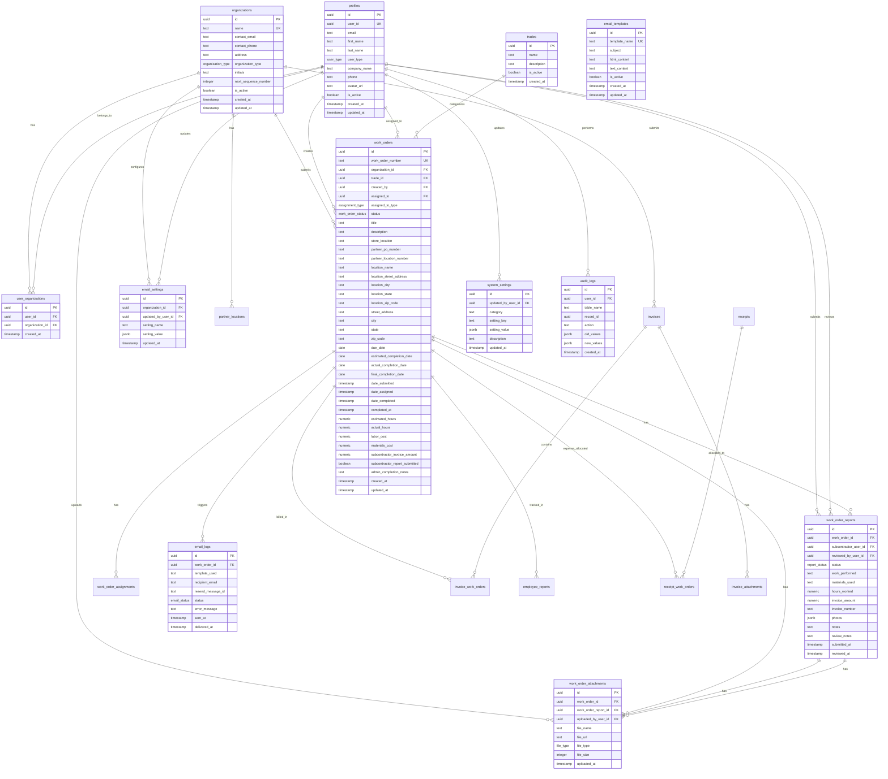

# WorkOrderPro Database Schema Documentation

## Executive Summary

WorkOrderPro uses a comprehensive **20-table** PostgreSQL database with Row Level Security (RLS) to manage construction work orders across four user types: Admins, Employees, Partners, and Subcontractors. The schema supports multi-assignee work order management, invoice management with dual numbering and draft support, user organization relationships, partner location management with structured addressing, reporting, email notifications, comprehensive audit logging, and advanced analytics through materialized views.

## Database Architecture Overview

### Core Tables (20)
1. **organizations** - Company/organization information
2. **user_organizations** - Many-to-many user-organization relationships  
3. **profiles** - Extended user profile information
4. **trades** - Available trade skills (Plumbing, HVAC, etc.)
5. **work_orders** - Main work order records
6. **work_order_assignments** - Multiple assignees per work order with roles
7. **work_order_reports** - Subcontractor completion reports
8. **work_order_attachments** - File attachments for work orders and reports
9. **partner_locations** - Partner location management for multi-site organizations
10. **invoices** - Subcontractor invoice management with dual numbering
11. **invoice_attachments** - Invoice document uploads (PDFs, images)
12. **invoice_work_orders** - Junction table linking invoices to work orders
13. **employee_reports** - Employee time tracking and work reporting
14. **receipts** - Employee expense receipt management
15. **receipt_work_orders** - Junction table for receipt allocation to work orders
16. **email_templates** - System email templates
17. **email_logs** - Email delivery tracking
18. **email_settings** - Email configuration per organization
19. **system_settings** - Global system configuration
20. **audit_logs** - Complete audit trail for all changes

### Materialized Views (2)
- **mv_work_order_analytics** - Performance analytics for work orders
- **mv_subcontractor_performance** - Subcontractor performance metrics

### Storage Buckets (3)
- **work-order-photos** - Public bucket for work order photo attachments
- **work-order-attachments** - Public bucket for work order attachments and invoice documents
- **avatars** - Public bucket for user profile avatars (5MB limit, image types only)

### Custom Enums (7)
- `user_type`: 'admin', 'partner', 'subcontractor', 'employee'
- `organization_type`: 'partner', 'subcontractor', 'internal'
- `work_order_status`: 'received', 'assigned', 'in_progress', 'completed', 'cancelled', 'estimate_needed'
- `assignment_type`: 'internal', 'subcontractor'
- `report_status`: 'submitted', 'reviewed', 'approved', 'rejected'  
- `email_status`: 'sent', 'delivered', 'failed', 'bounced'
- `file_type`: 'photo', 'invoice', 'document'

### Custom Functions (40+)
- Auth helper functions for RLS and security (12)
- Work order management and numbering (8)
- Trigger functions for automation (6)
- Email notification functions (5)
- Invoice management functions (4)
- Utility functions (3)
- Analytics and reporting functions (3)
- Status transition and completion logic (4)
- Audit and security functions (3)

## Entity Relationship Diagram



## Seed Data Structure

### Test Data Overview

The WorkOrderPro database includes comprehensive seed data for testing and development purposes. This data represents realistic business scenarios and covers all user types and workflows.

#### Test Organizations (8 total)

**Internal Organization (1):**
- **WorkOrderPro Internal** - The main contractor company housing admin users and employees

**Partner Organizations (3):**
- **ABC Property Management** - Multi-location property manager with 4 locations
- **XYZ Commercial Properties** - Commercial property specialist with 3 locations
- **Premium Facilities Group** - High-end facilities manager with 3 locations

**Subcontractor Organizations (4):**
- **Pipes & More Plumbing** - Plumbing specialists (2 technicians)
- **Sparks Electric** - Licensed electrical contractor (1 electrician)
- **Cool Air HVAC** - HVAC specialists (2 technicians)
- **Fix-It Maintenance** - General maintenance contractor (1 technician)

#### Test Users (14 total)

**Admin Users (2):**
- `admin@workorderpro.com` - Primary system administrator
- `employee@workorderpro.com` - Employee administration

**Internal Employees (3):**
- `senior@workorderpro.com` - Senior technician ($75/hr cost, $150/hr billable)
- `midlevel@workorderpro.com` - Mid-level technician ($50/hr cost, $100/hr billable)
- `junior@workorderpro.com` - Junior technician ($35/hr cost, $70/hr billable)

**Partner Users (3):**
- `partner1@abc.com` - ABC Property Management representative
- `partner2@xyz.com` - XYZ Commercial Properties representative
- `partner3@premium.com` - Premium Facilities Group representative

**Subcontractor Users (6):**
- `plumber1@trade.com` - Senior plumber (Pipes & More)
- `plumber2@trade.com` - Junior plumber (Pipes & More)
- `electrician@trade.com` - Licensed electrician (Sparks Electric)
- `hvac1@trade.com` - Senior HVAC technician (Cool Air)
- `hvac2@trade.com` - HVAC support technician (Cool Air)
- `maintenance@trade.com` - General maintenance technician (Fix-It)

All test users use the password: **Test123!**

#### Partner Locations (10 total)

**ABC Property Management (4 locations):**
- Downtown Office (504) - Primary business location
- Uptown Retail (502) - Customer-facing retail space
- Westside Apartments (503) - Residential complex
- Southend Mall (501) - *Inactive location for testing*

**XYZ Commercial Properties (3 locations):**
- Tech Center (TC-101) - Technology-focused commercial space
- Business Park (BP-201) - Multi-tenant business park
- Corporate Plaza (CP-301) - Executive office space

**Premium Facilities Group (3 locations):**
- Executive Tower (ET-001) - High-end office building
- Luxury Condos (LC-002) - Luxury residential property
- Premium Office Complex (OC-003) - Premium office space

#### Trade Categories (10 total)

1. **Plumbing** - Pipes & More Plumbing specialists
2. **Electrical** - Sparks Electric specialists
3. **HVAC** - Cool Air HVAC specialists
4. **Carpentry** - Internal employees or contractors
5. **Painting** - Internal employees or contractors
6. **General Maintenance** - Fix-It Maintenance or internal
7. **Landscaping** - External contractors
8. **Roofing** - Specialized contractors
9. **Flooring** - Specialized contractors
10. **Appliance Repair** - Specialized contractors

#### User Journey Test Scenarios

**Partner Journey:**
- Multi-location work order submission
- Location-specific work order numbering (ABC-504-001, XYZ-TC101-001, etc.)
- Work order status tracking and notifications
- Completion notifications and feedback

**Subcontractor Journey:**
- Work order assignment notifications
- Multi-technician assignments (lead/support roles)
- Work report submission with photos and invoicing
- Report review and feedback processes

**Employee Journey:**
- Internal work assignments with time tracking
- Multi-tier hourly rate structure testing
- Expense receipt management and allocation
- Lead and support role assignments

**Admin Journey:**
- Work order assignment and management
- Multi-assignee work order scenarios
- Report review and approval workflows
- Invoice processing and approval
- System administration and analytics

#### Financial Test Scenarios

**Employee Rate Structure:**
- Senior: $75/hr cost, $150/hr billable (2x markup)
- Mid-level: $50/hr cost, $100/hr billable (2x markup)
- Junior: $35/hr cost, $70/hr billable (2x markup)

**Invoice Testing:**
- Draft invoices (editable by subcontractors)
- Submitted invoices (pending review)
- Approved invoices (ready for payment)
- Paid invoices (completed transactions)
- Rejected invoices (requiring resubmission)

**Multi-work-order Invoicing:**
- Single work order invoices
- Multi work order invoices
- Partial work order billing
- Split billing scenarios across multiple work orders

This comprehensive seed data ensures thorough testing of all business workflows, user permissions, financial processes, and system integrations.

## Table Definitions

### 1. organizations
**Purpose**: Stores company information for partners (work order submitters), subcontractors (work performers), and internal (general contractor) organizations.

**Organization Types**:
- **internal**: The general contractor company (WorkOrderPro Internal) - houses admin users and employees
- **partner**: Property management companies that submit work orders 
- **subcontractor**: Trade companies that perform the work

| Column | Type | Nullable | Default | Description |
|--------|------|----------|---------|-------------|
| id | uuid | No | gen_random_uuid() | Primary key |
| name | text | No | - | Organization name |
| contact_email | text | No | - | Primary contact email |
| contact_phone | text | Yes | - | Contact phone number |
| address | text | Yes | - | Organization address |
| organization_type | organization_type | No | 'partner' | Organization type: partner/subcontractor/internal |
| initials | text | Yes | - | Organization abbreviation for work order numbering (e.g., 'ABC', 'WOP') |
| next_sequence_number | integer | No | 1 | Next available sequence number for this organization |
| is_active | boolean | No | true | Whether organization is active |
| created_at | timestamp | No | now() | Creation timestamp |
| updated_at | timestamp | No | now() | Last update timestamp |

**Constraints**:
- `organizations_name_unique` UNIQUE (name)

**Indexes**:
- `idx_organizations_active` ON (is_active)
- `idx_organizations_contact_email` ON (contact_email)
- `idx_organizations_type` ON (organization_type)
- `idx_organizations_type_active` ON (organization_type, is_active)
- `idx_organizations_initials` ON (initials)

### 2. user_organizations  
**Purpose**: Junction table linking users to organizations (many-to-many relationship).

| Column | Type | Nullable | Default | Description |
|--------|------|----------|---------|-------------|
| id | uuid | No | gen_random_uuid() | Primary key |
| user_id | uuid | No | - | References profiles.id |
| organization_id | uuid | No | - | References organizations.id |
| created_at | timestamp | No | now() | Creation timestamp |

**Indexes**:
- `idx_user_organizations_user_id` ON (user_id)
- `idx_user_organizations_organization_id` ON (organization_id)

### 3. profiles
**Purpose**: Extended user profile information beyond Supabase Auth.

| Column | Type | Nullable | Default | Description |
|--------|------|----------|---------|-------------|
| id | uuid | No | gen_random_uuid() | Primary key |
| user_id | uuid | No | - | References auth.users.id |
| email | text | No | - | User email address |
| first_name | text | No | - | User first name |
| last_name | text | No | - | User last name |
| user_type | user_type | No | 'subcontractor' | User type enum |
| company_name | text | Yes | - | Company name for subcontractors |
| phone | text | Yes | - | Phone number |
| avatar_url | text | Yes | - | Profile picture URL |
| hourly_cost_rate | decimal(10,2) | Yes | - | Internal cost rate for employee hours |
| hourly_billable_rate | decimal(10,2) | Yes | - | Rate charged to clients for employee hours |
| is_employee | boolean | No | false | Flag to identify employees vs external users |
| is_active | boolean | No | true | Whether user is active |
| created_at | timestamp | No | now() | Creation timestamp |
| updated_at | timestamp | No | now() | Last update timestamp |

**Indexes**:
- `idx_profiles_user_id` ON (user_id)
- `idx_profiles_user_type` ON (user_type)
- `idx_profiles_email` ON (email)

### 4. trades
**Purpose**: Available trade skills and categories for work orders.

| Column | Type | Nullable | Default | Description |
|--------|------|----------|---------|-------------|
| id | uuid | No | gen_random_uuid() | Primary key |
| name | text | No | - | Trade name (e.g., "Plumbing", "HVAC") |
| description | text | Yes | - | Trade description |
| is_active | boolean | No | true | Whether trade is available |
| created_at | timestamp | No | now() | Creation timestamp |

**Indexes**:
- `idx_trades_active` ON (is_active)

### 5. work_orders
**Purpose**: Main work order records with complete lifecycle tracking.

| Column | Type | Nullable | Default | Description |
|--------|------|----------|---------|-------------|
| id | uuid | No | gen_random_uuid() | Primary key |
| work_order_number | text | Yes | - | Auto-generated work order number |
| organization_id | uuid | Yes | - | References organizations.id (submitting organization) |
| assigned_organization_id | uuid | Yes | - | References organizations.id (assigned organization) |
| trade_id | uuid | Yes | - | References trades.id |
| created_by | uuid | No | - | References profiles.id |
| assigned_to | uuid | Yes | - | References profiles.id |
| assigned_to_type | assignment_type | Yes | - | 'internal' or 'subcontractor' |
| status | work_order_status | No | 'received' | Current status |
| title | text | No | - | Work order title |
| description | text | Yes | - | Detailed description |
| store_location | text | Yes | - | Store/location identifier |
| street_address | text | Yes | - | Street address |
| city | text | Yes | - | City |
| state | text | Yes | - | State |
| zip_code | text | Yes | - | ZIP code |
| partner_po_number | text | Yes | - | Partner's purchase order reference |
| partner_location_number | text | Yes | - | Partner's internal location identifier |
| location_address | text | Yes | - | Full address override for specific job site |
| location_name | text | Yes | - | Descriptive name for the work location |
| due_date | date | Yes | - | Due date |
| estimated_completion_date | date | Yes | - | Estimated completion |
| actual_completion_date | date | Yes | - | Actual completion |
| final_completion_date | date | Yes | - | Final completion |
| date_submitted | timestamp | No | now() | Submission timestamp |
| date_assigned | timestamp | Yes | - | Assignment timestamp |
| date_completed | timestamp | Yes | - | Completion timestamp |
| completed_at | timestamp | Yes | - | Completion timestamp |
| estimated_hours | numeric | Yes | - | Estimated work hours |
| actual_hours | numeric | Yes | - | Actual work hours |
| labor_cost | numeric | Yes | - | Labor cost |
| materials_cost | numeric | Yes | - | Materials cost |
| subcontractor_invoice_amount | numeric | Yes | - | Subcontractor invoice amount |
| subcontractor_report_submitted | boolean | Yes | false | Whether report submitted |
| admin_completion_notes | text | Yes | - | Admin completion notes |
| completion_method | text | Yes | 'manual' | How work order was completed ('automatic', 'manual', 'manual_override') |
| auto_completion_blocked | boolean | Yes | false | Admin flag to prevent automatic completion |
| completion_checked_at | timestamp | Yes | - | Last time completion logic was checked |
| created_at | timestamp | No | now() | Creation timestamp |
| updated_at | timestamp | No | now() | Last update timestamp |

**Indexes**:
- `idx_work_orders_organization_status` ON (organization_id, status)
- `idx_work_orders_assigned_status` ON (assigned_to, status)
- `idx_work_orders_trade` ON (trade_id)
- `idx_work_orders_created_by` ON (created_by)
- `idx_work_orders_status` ON (status)
- `idx_work_orders_organization_id` ON (organization_id)
- `idx_work_orders_assigned_to` ON (assigned_to)
- `idx_work_orders_trade_id` ON (trade_id)
- `idx_work_orders_partner_po` ON (partner_po_number)
- `idx_work_orders_partner_location` ON (partner_location_number)
- `idx_work_orders_assigned_org` ON (assigned_organization_id)
- `idx_work_orders_location_name` ON (location_name)

### 6. work_order_assignments
**Purpose**: Multiple assignees per work order with role-based assignment tracking.

| Column | Type | Nullable | Default | Description |
|--------|------|----------|---------|-------------|
| id | uuid | No | gen_random_uuid() | Primary key |
| work_order_id | uuid | No | - | References work_orders.id |
| assigned_to | uuid | No | - | References profiles.id (assignee) |
| assigned_organization_id | uuid | Yes | - | References organizations.id (assignee's org) |
| assignment_type | text | No | - | Assignment role: 'lead' or 'support' |
| assigned_at | timestamp | No | now() | Assignment timestamp |
| assigned_by | uuid | No | - | References profiles.id (assigner) |
| notes | text | Yes | - | Assignment notes |
| created_at | timestamp | No | now() | Creation timestamp |
| updated_at | timestamp | No | now() | Last update timestamp |

**Constraints**:
- `work_order_assignments_work_order_id_assigned_to_key` UNIQUE (work_order_id, assigned_to)
- `work_order_assignments_assignment_type_check` CHECK (assignment_type IN ('lead', 'support'))

**Indexes**:
- `idx_work_order_assignments_work_order` ON (work_order_id)
- `idx_work_order_assignments_assigned_to` ON (assigned_to)
- `idx_work_order_assignments_organization` ON (assigned_organization_id)
- `idx_work_order_assignments_wo_type` ON (work_order_id, assignment_type)
- `idx_work_order_assignments_assignee_type` ON (assigned_to, assignment_type)
- `idx_work_order_assignments_org_type_combo` ON (assigned_organization_id, assignment_type)
- `idx_work_order_assignments_org_wo_combo` ON (assigned_organization_id, work_order_id)

**Triggers**:
- `auto_populate_assignment_organization_trigger` - Auto-populates assigned_organization_id on INSERT

**Additional Indexes**:
- `idx_work_order_assignments_assigned_at` ON (assigned_at)
- `idx_work_order_assignments_assignee_type_combo` ON (assigned_to, assignment_type)
- `idx_work_order_assignments_wo_assignee_combo` ON (work_order_id, assigned_to)

### 7. work_order_reports
**Purpose**: Subcontractor completion reports with review workflow.

| Column | Type | Nullable | Default | Description |
|--------|------|----------|---------|-------------|
| id | uuid | No | gen_random_uuid() | Primary key |
| work_order_id | uuid | No | - | References work_orders.id |
| subcontractor_user_id | uuid | No | - | References profiles.id |
| reviewed_by_user_id | uuid | Yes | - | References profiles.id |
| status | report_status | No | 'submitted' | Report status |
| work_performed | text | No | - | Description of work performed |
| materials_used | text | Yes | - | Materials used |
| hours_worked | numeric | Yes | - | Hours worked |
| invoice_amount | numeric | No | - | Invoice amount |
| invoice_number | text | Yes | - | Invoice number |
| photos | jsonb | Yes | - | Photo URLs |
| notes | text | Yes | - | Additional notes |
| review_notes | text | Yes | - | Review feedback |
| submitted_at | timestamp | No | now() | Submission timestamp |
| reviewed_at | timestamp | Yes | - | Review timestamp |

**Indexes**:
- `idx_work_order_reports_work_order` ON (work_order_id)
- `idx_work_order_reports_subcontractor` ON (subcontractor_user_id)
- `idx_work_order_reports_status` ON (status)

### 8. work_order_attachments
**Purpose**: File attachments for work orders and reports.

| Column | Type | Nullable | Default | Description |
|--------|------|----------|---------|-------------|
| id | uuid | No | gen_random_uuid() | Primary key |
| work_order_id | uuid | Yes | - | References work_orders.id |
| work_order_report_id | uuid | Yes | - | References work_order_reports.id |
| uploaded_by_user_id | uuid | No | - | References profiles.id |
| file_name | text | No | - | Original file name |
| file_url | text | No | - | Storage URL |
| file_type | file_type | No | - | File type enum |
| file_size | integer | Yes | - | File size in bytes |
| uploaded_at | timestamp | No | now() | Upload timestamp |

**Indexes**:
- `idx_work_order_attachments_work_order` ON (work_order_id)
- `idx_work_order_attachments_report` ON (work_order_report_id)
- `idx_work_order_attachments_uploader` ON (uploaded_by_user_id)

### 8. email_templates
**Purpose**: System email templates for notifications.

| Column | Type | Nullable | Default | Description |
|--------|------|----------|---------|-------------|
| id | uuid | No | gen_random_uuid() | Primary key |
| template_name | text | No | - | Unique template identifier |
| subject | text | No | - | Email subject |
| html_content | text | No | - | HTML email content |
| text_content | text | Yes | - | Plain text content |
| is_active | boolean | No | true | Whether template is active |
| created_at | timestamp | No | now() | Creation timestamp |
| updated_at | timestamp | No | now() | Last update timestamp |

**Constraints**:
- `email_templates_template_name_unique` UNIQUE (template_name)

**Indexes**:
- `idx_email_templates_is_active` ON (is_active)

### 9. email_logs
**Purpose**: Email delivery tracking and status.

| Column | Type | Nullable | Default | Description |
|--------|------|----------|---------|-------------|
| id | uuid | No | gen_random_uuid() | Primary key |
| work_order_id | uuid | Yes | - | References work_orders.id |
| template_used | text | Yes | - | Template name used |
| recipient_email | text | No | - | Recipient email |
| resend_message_id | text | Yes | - | Resend service message ID |
| status | email_status | No | 'sent' | Email status |
| error_message | text | Yes | - | Error message if failed |
| sent_at | timestamp | No | now() | Send timestamp |
| delivered_at | timestamp | Yes | - | Delivery timestamp |

**Indexes**:
- `idx_email_logs_work_order` ON (work_order_id)
- `idx_email_logs_status` ON (status)
- `idx_email_logs_sent_at` ON (sent_at)

### 10. email_settings
**Purpose**: Email configuration per organization.

| Column | Type | Nullable | Default | Description |
|--------|------|----------|---------|-------------|
| id | uuid | No | gen_random_uuid() | Primary key |
| organization_id | uuid | Yes | - | References organizations.id |
| updated_by_user_id | uuid | No | - | References profiles.id |
| setting_name | text | No | - | Setting identifier |
| setting_value | jsonb | No | - | Setting value |
| updated_at | timestamp | No | now() | Last update timestamp |

### 11. system_settings
**Purpose**: Global system configuration.

| Column | Type | Nullable | Default | Description |
|--------|------|----------|---------|-------------|
| id | uuid | No | gen_random_uuid() | Primary key |
| updated_by_user_id | uuid | No | - | References profiles.id |
| category | text | No | - | Setting category |
| setting_key | text | No | - | Setting key |
| setting_value | jsonb | No | - | Setting value |
| description | text | Yes | - | Setting description |
| updated_at | timestamp | No | now() | Last update timestamp |

### 12. work_order_assignments
**Purpose**: Multiple assignees per work order with role definitions.

| Column | Type | Nullable | Default | Description |
|--------|------|----------|---------|-------------|
| id | uuid | No | gen_random_uuid() | Primary key |
| work_order_id | uuid | No | - | References work_orders.id (CASCADE DELETE) |
| assigned_to | uuid | No | - | References profiles.id (CASCADE DELETE) |
| assigned_organization_id | uuid | Yes | - | References organizations.id (SET NULL) |
| assignment_type | text | No | - | Role: 'lead' or 'support' |
| assigned_at | timestamp | No | now() | Assignment timestamp |
| assigned_by | uuid | No | - | References profiles.id (CASCADE DELETE) |
| notes | text | Yes | - | Assignment-specific notes |
| created_at | timestamp | No | now() | Record creation timestamp |
| updated_at | timestamp | No | now() | Last update timestamp |

**Constraints**:
- UNIQUE(work_order_id, assigned_to) - One assignment per person per work order
- CHECK assignment_type IN ('lead', 'support')

**Indexes**:
- `idx_work_order_assignments_work_order` ON (work_order_id)
- `idx_work_order_assignments_assigned_to` ON (assigned_to)
- `idx_work_order_assignments_organization` ON (assigned_organization_id)
- `idx_work_order_assignments_wo_type` ON (work_order_id, assignment_type)
- `idx_work_order_assignments_assignee_type` ON (assigned_to, assignment_type)
- `idx_work_order_assignments_assigned_at` ON (assigned_at)

**Business Rules**:
- **Lead Assignment**: Primary person responsible for work order completion
- **Support Assignment**: Supporting team member assisting with work
- **Multi-Organization**: Supports teams from different organizations
- **Audit Trail**: Tracks who made assignments and when

### 13. employee_reports

**Purpose**: Employee time tracking and work reporting with automatic cost calculation.

| Column | Type | Nullable | Default | Description |
|--------|------|----------|---------|-------------|
| id | uuid | No | gen_random_uuid() | Primary key |
| work_order_id | uuid | No | - | References work_orders.id (CASCADE DELETE) |
| employee_user_id | uuid | No | - | References profiles.id (CASCADE DELETE) |
| report_date | date | No | - | Date of work performed |
| hours_worked | decimal(5,2) | No | - | Hours spent on work order |
| hourly_rate_snapshot | decimal(10,2) | No | - | Employee's rate at time of report |
| total_labor_cost | decimal(10,2) | - | GENERATED | **GENERATED COLUMN** (hours × rate) |
| work_performed | text | No | - | Description of work completed |
| notes | text | Yes | - | Additional notes or comments |
| created_at | timestamp | No | now() | Creation timestamp |
| updated_at | timestamp | No | now() | Last update timestamp |

**Constraints**:
- `employee_reports_work_order_date_unique` UNIQUE (work_order_id, employee_user_id, report_date)
- CHECK (hours_worked >= 0)
- CHECK (hourly_rate_snapshot >= 0)

**Indexes**:
- `idx_employee_reports_work_order` ON (work_order_id)
- `idx_employee_reports_employee` ON (employee_user_id)
- `idx_employee_reports_date` ON (report_date)
- `idx_employee_reports_employee_date` ON (employee_user_id, report_date)

**Business Rules**:
- One report per employee per work order per day
- Rate snapshot preserves historical cost accuracy
- Total cost automatically calculated and stored
- Integrates with work order labor cost tracking

---

### 9. partner_locations

**Purpose**: Manages multiple locations for partner organizations with complete contact information.
**RLS**: ✅ Enabled - Enforces organization-based access control for multi-site partners

| Column | Type | Nullable | Default | Description |
|--------|------|----------|---------|-------------|
| id | uuid | No | gen_random_uuid() | Primary key |
| organization_id | uuid | No | - | References organizations.id |
| location_number | text | No | - | Partner's internal location identifier |
| location_name | text | No | - | Descriptive name for the location |
| street_address | text | Yes | - | Street address |
| city | text | Yes | - | City |
| state | text | Yes | - | State |
| zip_code | text | Yes | - | ZIP code |
| contact_name | text | Yes | - | Location contact person |
| contact_phone | text | Yes | - | Location phone number |
| contact_email | text | Yes | - | Location email address |
| is_active | boolean | No | true | Whether location is active |
| created_at | timestamp | No | now() | Creation timestamp |
| updated_at | timestamp | No | now() | Last update timestamp |

**Indexes**:
- `idx_partner_locations_organization` ON (organization_id)
- `idx_partner_locations_active` ON (is_active)
- `idx_partner_locations_location_number` ON (location_number)

**Business Rules**:
- Enables partner organizations to manage multiple store/site locations
- Location numbers should be unique within an organization
- Used for work order location context and routing
- Supports detailed contact information per location

---

### 19. receipts

**Purpose**: Employee expense receipt management and tracking.

| Column | Type | Nullable | Default | Description |
|--------|------|----------|---------|-------------|
| id | uuid | No | gen_random_uuid() | Primary key |
| employee_user_id | uuid | No | - | References profiles.id (CASCADE DELETE) |
| vendor_name | text | No | - | Who the expense was paid to |
| receipt_date | date | No | - | Date of purchase/expense |
| amount | decimal(10,2) | No | - | Total receipt amount |
| description | text | Yes | - | What was purchased |
| receipt_image_url | text | Yes | - | Optional photo of receipt (Supabase Storage) |
| notes | text | Yes | - | Additional context or explanations |
| created_at | timestamp | No | now() | Creation timestamp |
| updated_at | timestamp | No | now() | Last update timestamp |

**Constraints**:
- CHECK (amount >= 0)

**Indexes**:
- `idx_receipts_employee` ON (employee_user_id)
- `idx_receipts_date` ON (receipt_date)
- `idx_receipts_vendor` ON (vendor_name)
- `idx_receipts_amount` ON (amount)

**Business Rules**:
- Tracks employee out-of-pocket expenses
- Supports receipt photo uploads for documentation
- Can be allocated across multiple work orders
- Separate from subcontractor material costs

---

### 20. receipt_work_orders

**Purpose**: Junction table for allocating receipt expenses across work orders.

| Column | Type | Nullable | Default | Description |
|--------|------|----------|---------|-------------|
| id | uuid | No | gen_random_uuid() | Primary key |
| receipt_id | uuid | No | - | References receipts.id (CASCADE DELETE) |
| work_order_id | uuid | No | - | References work_orders.id (CASCADE DELETE) |
| allocated_amount | decimal(10,2) | No | - | Portion of receipt allocated to this work order |
| allocation_notes | text | Yes | - | Explanation for allocation logic |
| created_at | timestamp | No | now() | Creation timestamp |

**Constraints**:
- UNIQUE(receipt_id, work_order_id) - No duplicate allocations per work order
- CHECK (allocated_amount >= 0)

**Indexes**:
- `idx_receipt_work_orders_receipt` ON (receipt_id)
- `idx_receipt_work_orders_work_order` ON (work_order_id)

**Business Rules**:
- Enables flexible expense distribution
- Supports partial receipt allocation
- Sum of allocations should not exceed receipt amount
- Allows detailed expense tracking per work order

---

### 16. invoices

**Purpose**: Manages subcontractor invoices with dual numbering system and approval workflow.
**RLS**: ✅ Enabled - Enforces subcontractor financial privacy and organization-based access control

| Column | Type | Nullable | Default | Description |
|--------|------|----------|---------|-------------|
| id | uuid | No | gen_random_uuid() | Primary key |
| internal_invoice_number | text | No | - | Auto-generated internal reference (INV-YYYY-00001) |
| external_invoice_number | text | Yes | - | Subcontractor's invoice number (optional) |
| subcontractor_organization_id | uuid | No | - | References organizations.id |
| submitted_by | uuid | Yes | - | References profiles.id (user who submitted, nullable for drafts) |
| submitted_at | timestamp | Yes | - | Submission timestamp (nullable for drafts) |
| status | text | No | 'submitted' | Current status (draft/submitted/approved/rejected/paid) |
| total_amount | decimal(12,2) | Yes | - | Total invoice amount (nullable for drafts) |
| approved_by | uuid | Yes | - | References profiles.id (admin who approved) |
| approved_at | timestamp | Yes | - | Approval timestamp |
| approval_notes | text | Yes | - | Admin approval or rejection notes |
| paid_at | timestamp | Yes | - | Payment completion timestamp |
| payment_reference | text | Yes | - | Payment reference number |
| created_at | timestamp | No | now() | Creation timestamp |
| updated_at | timestamp | No | now() | Last update timestamp |

**Constraints**:
- `invoices_internal_number_unique` UNIQUE (internal_invoice_number)

**Indexes**:
- `idx_invoices_organization` ON (subcontractor_organization_id)
- `idx_invoices_status` ON (status)
- `idx_invoices_submitted_by` ON (submitted_by)
- `idx_invoices_approved_by` ON (approved_by)

**Business Rules**:
- Dual numbering: internal system number + optional external number
- Approval workflow with status tracking
- Payment tracking with reference numbers
- Audit trail for all status changes

### 17. invoice_attachments

**Purpose**: Stores uploaded invoice documents and files (PDFs, images) for invoice submissions

| Column | Type | Nullable | Default | Description |
|--------|------|----------|---------|-------------|
| id | uuid | No | gen_random_uuid() | Primary key |
| invoice_id | uuid | No | - | Associated invoice |
| file_name | text | No | - | Original filename |
| file_url | text | No | - | Storage URL for file |
| file_type | file_type | No | 'document' | Type of file (document, photo, invoice) |
| file_size | integer | Yes | - | File size in bytes |
| uploaded_by | uuid | No | - | User who uploaded file |
| created_at | timestamp | No | now() | Upload timestamp |

**Constraints**:
- Foreign keys: invoice_id → invoices(id) ON DELETE CASCADE, uploaded_by → profiles(id)
- Enum constraints: file_type must be valid enum value

**Indexes**:
- `idx_invoice_attachments_invoice` ON (invoice_id)
- `idx_invoice_attachments_uploader` ON (uploaded_by)

**Business Rules**:
- Files are deleted when parent invoice is deleted
- File type defaults to 'document' for invoice submissions
- Upload tracking maintains user accountability
- Supports multiple attachments per invoice

| Column | Type | Nullable | Default | Description |
|--------|------|----------|---------|-------------|
| id | uuid | No | gen_random_uuid() | Primary key |
| internal_invoice_number | text | No | - | Auto-generated internal reference (INV-YYYY-00001) |
| external_invoice_number | text | Yes | - | Subcontractor's invoice number (optional) |
| subcontractor_organization_id | uuid | No | - | References organizations.id |
| submitted_by | uuid | No | - | References profiles.id (invoice creator) |
| total_amount | decimal(10,2) | No | - | Total invoice amount |
| status | text | No | 'submitted' | Invoice status workflow |
| submitted_at | timestamp | Yes | - | Submission timestamp |
| approved_by | uuid | Yes | - | References profiles.id (approver) |
| approved_at | timestamp | Yes | - | Approval timestamp |
| approval_notes | text | Yes | - | Approval/rejection notes |
| payment_reference | text | Yes | - | Payment reference (check number, etc.) |
| paid_at | timestamp | Yes | - | Payment completion timestamp |
| created_at | timestamp | No | now() | Creation timestamp |
| updated_at | timestamp | No | now() | Last update timestamp |

**Constraints**:
- `invoices_internal_invoice_number_unique` UNIQUE (internal_invoice_number)
- CHECK (total_amount >= 0)
- CHECK (status IN ('draft', 'submitted', 'approved', 'rejected', 'paid'))
- Validation trigger ensures required fields present for submitted invoices

**Indexes**:
- `idx_invoices_organization` ON (subcontractor_organization_id)
- `idx_invoices_submitted_by` ON (submitted_by)
- `idx_invoices_status` ON (status)
- `idx_invoices_internal_number` ON (internal_invoice_number)
- `idx_invoices_approved_by` ON (approved_by)
- `idx_invoices_submitted_at` ON (submitted_at)
- `idx_invoices_paid_at` ON (paid_at)
- `idx_invoices_org_status` ON (subcontractor_organization_id, status)
- `idx_invoices_status_dates` ON (status, submitted_at, paid_at)

**Business Rules**:
- **Internal numbering**: Auto-generated format INV-YYYY-00001 with annual sequence (only for submitted invoices)
- **External numbering**: Optional subcontractor's own invoice number
- **Status workflow**: draft → submitted → approved/rejected → paid
- **Draft support**: Allows NULL values for required fields during draft stage
- **Validation**: Trigger ensures all required fields present before submission
- **Amount validation**: Must be positive monetary amount
- **Payment tracking**: Reference and timestamp required when paid

### 18. invoice_work_orders

**Purpose**: Junction table linking invoices to multiple work orders with itemized amounts.
**RLS**: ✅ Enabled - Matches parent invoice permissions for data consistency

| Column | Type | Nullable | Default | Description |
|--------|------|----------|---------|-------------|
| id | uuid | No | gen_random_uuid() | Primary key |
| invoice_id | uuid | No | - | References invoices.id (CASCADE DELETE) |
| work_order_id | uuid | No | - | References work_orders.id |
| work_order_report_id | uuid | Yes | - | References work_order_reports.id (optional) |
| amount | decimal(10,2) | No | - | Amount allocated to this work order |
| description | text | Yes | - | Optional line item description |
| created_at | timestamp | No | now() | Creation timestamp |

**Constraints**:
- UNIQUE(invoice_id, work_order_id) - No duplicate work orders per invoice
- CHECK (amount >= 0)

**Indexes**:
- `idx_invoice_work_orders_invoice` ON (invoice_id)
- `idx_invoice_work_orders_work_order` ON (work_order_id)
- `idx_invoice_work_orders_report` ON (work_order_report_id)

**Business Rules**:
- **Multi-work-order billing**: Single invoice can cover multiple work orders
- **Itemized amounts**: Individual amount allocation per work order
- **Report linkage**: Optional connection to specific work order reports
- **Cascade deletion**: Invoice deletion removes all line items

### 15. audit_logs
**Purpose**: Complete audit trail for all system changes.

| Column | Type | Nullable | Default | Description |
|--------|------|----------|---------|-------------|
| id | uuid | No | gen_random_uuid() | Primary key |
| user_id | uuid | Yes | - | References profiles.id |
| table_name | text | No | - | Affected table |
| record_id | uuid | No | - | Affected record ID |
| action | text | No | - | Action performed |
| old_values | jsonb | Yes | - | Previous values |
| new_values | jsonb | Yes | - | New values |
| created_at | timestamp | No | now() | Action timestamp |

**Indexes**:
- `idx_audit_logs_table_record` ON (table_name, record_id)
- `idx_audit_logs_user` ON (user_id)
- `idx_audit_logs_created_at` ON (created_at)

## Materialized Views

### 1. mv_work_order_analytics
**Purpose**: Performance analytics for work orders with aggregated data.

| Column | Type | Description |
|--------|------|-------------|
| submission_date | date | Daily submission date |
| submission_week | date | Weekly submission date |
| submission_month | date | Monthly submission date |
| total_orders | bigint | Total work orders |
| received_count | bigint | Orders in received status |
| assigned_count | bigint | Orders in assigned status |
| in_progress_count | bigint | Orders in progress |
| completed_count | bigint | Completed orders |
| cancelled_count | bigint | Cancelled orders |
| avg_completion_hours | numeric | Average completion time in hours |
| total_invoice_amount | numeric | Total invoice amounts |
| trade_id | uuid | Trade category |
| organization_id | uuid | Organization |

**Indexes**:
- `idx_mv_work_order_analytics_submission_date` ON (submission_date)
- `idx_mv_work_order_analytics_trade_id` ON (trade_id)
- `idx_mv_work_order_analytics_organization_id` ON (organization_id)

### 2. mv_subcontractor_performance
**Purpose**: Subcontractor performance metrics and quality scores.

| Column | Type | Description |
|--------|------|-------------|
| subcontractor_id | uuid | Subcontractor profile ID |
| first_name | text | Subcontractor first name |
| last_name | text | Subcontractor last name |
| company_name | text | Company name |
| total_jobs | bigint | Total jobs assigned |
| completed_jobs | bigint | Successfully completed jobs |
| on_time_jobs | bigint | Jobs completed on time |
| avg_completion_hours | numeric | Average completion time |
| avg_invoice_amount | numeric | Average invoice amount |
| total_invoice_amount | numeric | Total invoice amount |
| quality_score | numeric | Quality score based on report approvals |

## Storage Configuration

The system uses **3 storage buckets** for file uploads and management:

### Storage Buckets

#### avatars
- **Purpose**: Store user profile pictures for all user types
- **Public Access**: Yes (enables direct URL access for display)
- **File Types**: Images (JPEG, PNG, WEBP)  
- **Size Limit**: 5MB
- **Path Structure**: `/{user_id}/{filename}`
- **Allowed MIME Types**: `image/jpeg`, `image/png`, `image/webp`

#### work-order-attachments
- **Purpose**: Store various file attachments for work orders and reports
- **Public Access**: Yes (enables direct URL access)
- **File Types**: Photos, invoices, documents, receipts
- **Path Structure**: `/{user_id}/{work_order_id|report_id}/{filename}`
- **Usage**: Work order reports, employee time reports, receipt images

#### work-order-photos
- **Purpose**: Legacy bucket for work order report photos (superseded by work-order-attachments)
- **Public Access**: Yes
- **File Types**: Images (JPEG, PNG, WEBP)
- **Path Structure**: `/{user_id}/{work_order_id}/{timestamp}_{filename}`

### Storage Policies

Storage policies control access to uploaded files across all buckets:

#### Avatar Policies (avatars bucket)
1. **Avatar images are publicly accessible** (SELECT)
   - Allows public read access to all avatar images
   - Enables profile picture display across the application

2. **Users can upload their own avatar** (INSERT)
   - Users can upload files to their own user folder
   - Validates ownership through folder path matching user ID

3. **Users can update their own avatar** (UPDATE)
   - Allows users to modify their avatar file metadata
   - Restricted to files in user's own folder

4. **Users can delete their own avatar** (DELETE)
   - Enables users to remove their profile pictures
   - Restricted to files in user's own folder

#### Work Order Attachment Policies (work-order-attachments bucket)
5. **Subcontractors can upload attachments for their reports** (INSERT)
   - Allows subcontractors to upload files for work order reports
   - Validates user ownership and subcontractor status

6. **Employees can upload attachments for their time reports** (INSERT)
   - Allows admin users who are employees to upload receipt images
   - Validates employee status through profiles.is_employee flag
   - Used for time report receipt documentation

7. **Users can view work order attachments** (SELECT)
   - Complex access control:
   - Subcontractors: Own attachments only
   - Admins: All attachments
   - Partners: Attachments for their organization's work orders

8. **Subcontractors can update their own attachments** (UPDATE)
   - Allows file metadata updates for owned files
   - Restricted to subcontractor's own uploads

9. **Subcontractors can delete their own attachments** (DELETE)
   - Enables file removal for owned files
   - Restricted to subcontractor's own uploads

#### Work Order Photo Policies (work-order-photos bucket)
10. **Subcontractors can upload photos for their reports** (INSERT)
    - Legacy policy for photo uploads
    - Validates user ownership and subcontractor status

11. **Users can view work order photos** (SELECT)
    - Multi-tier access control similar to attachments
    - Supports subcontractor, admin, and partner access levels

12. **Subcontractors can update their own photos** (UPDATE)
    - File metadata modification for owned photos

13. **Subcontractors can delete their own photos** (DELETE)
    - File removal for owned photos

## Database Functions

### User Management Functions

#### 1. get_current_user_type()
**Purpose**: Returns the current user's type for RLS policies.
```sql
CREATE OR REPLACE FUNCTION public.get_current_user_type()
RETURNS user_type
LANGUAGE plpgsql
STABLE SECURITY DEFINER
AS $function$
BEGIN
  RETURN public.get_user_type_secure(auth.uid());
END;
$function$
```

#### 2. get_user_type_secure(user_uuid)
**Purpose**: Secure function to get user type without RLS recursion.
```sql
CREATE OR REPLACE FUNCTION public.get_user_type_secure(user_uuid uuid DEFAULT auth.uid())
RETURNS user_type
LANGUAGE plpgsql
STABLE SECURITY DEFINER
AS $function$
DECLARE
  result user_type;
BEGIN
  SELECT user_type INTO result 
  FROM public.profiles 
  WHERE user_id = user_uuid 
  LIMIT 1;
  
  RETURN COALESCE(result, 'subcontractor'::user_type);
END;
$function$
```

#### 3. is_admin()
**Purpose**: Check if current user is admin.
```sql
CREATE OR REPLACE FUNCTION public.is_admin()
RETURNS boolean
LANGUAGE plpgsql
STABLE SECURITY DEFINER
AS $function$
BEGIN
  RETURN public.get_user_type_secure(auth.uid()) = 'admin';
END;
$function$
```

#### 4. get_user_organizations()
**Purpose**: Returns organizations the current user belongs to.
```sql
CREATE OR REPLACE FUNCTION public.get_user_organizations()
RETURNS TABLE(organization_id uuid)
LANGUAGE plpgsql
STABLE SECURITY DEFINER
AS $function$
BEGIN
  RETURN QUERY
  SELECT uo.organization_id 
  FROM public.user_organizations uo
  JOIN public.profiles p ON p.id = uo.user_id
  WHERE p.user_id = auth.uid();
END;
$function$
```

#### 5. user_belongs_to_organization(org_id)
**Purpose**: Check if user belongs to specific organization.
```sql
CREATE OR REPLACE FUNCTION public.user_belongs_to_organization(org_id uuid)
RETURNS boolean
LANGUAGE plpgsql
STABLE SECURITY DEFINER
AS $function$
BEGIN
  RETURN EXISTS (
    SELECT 1 
    FROM public.get_user_organizations() 
    WHERE organization_id = org_id
  );
END;
$function$
```

#### 6. user_assigned_to_work_order(wo_id)
**Purpose**: Check if user is assigned to specific work order.
```sql
CREATE OR REPLACE FUNCTION public.user_assigned_to_work_order(wo_id uuid)
RETURNS boolean
LANGUAGE plpgsql
STABLE SECURITY DEFINER
AS $function$
BEGIN
  RETURN EXISTS (
    SELECT 1 
    FROM public.work_orders wo
    JOIN public.profiles p ON p.id = wo.assigned_to
    WHERE wo.id = wo_id AND p.user_id = auth.uid()
  );
END;
$function$
```

### Work Order Functions

#### 7. generate_work_order_number()
**Purpose**: Auto-generate work order numbers.
```sql
CREATE OR REPLACE FUNCTION public.generate_work_order_number()
RETURNS text
LANGUAGE plpgsql
AS $function$
DECLARE
  current_year TEXT;
  sequence_num INTEGER;
  work_order_num TEXT;
BEGIN
  current_year := EXTRACT(YEAR FROM now())::TEXT;
  
  SELECT COALESCE(MAX(
    CASE 
      WHEN work_order_number ~ ('^WO-' || current_year || '-[0-9]+$')
      THEN CAST(SUBSTRING(work_order_number FROM LENGTH('WO-' || current_year || '-') + 1) AS INTEGER)
      ELSE 0
    END
  ), 0) + 1
  INTO sequence_num
  FROM public.work_orders;
  
  work_order_num := 'WO-' || current_year || '-' || LPAD(sequence_num::TEXT, 4, '0');
  
  RETURN work_order_num;
END;
$function$
```

### Analytics Functions

#### 8. calculate_completion_time_by_trade(start_date, end_date)
**Purpose**: Calculate average completion times by trade category.
```sql
CREATE OR REPLACE FUNCTION public.calculate_completion_time_by_trade(
  start_date date DEFAULT CURRENT_DATE - INTERVAL '30 days',
  end_date date DEFAULT CURRENT_DATE
)
RETURNS TABLE (
  trade_name text,
  avg_completion_hours numeric,
  total_orders bigint,
  completed_orders bigint
)
LANGUAGE plpgsql
STABLE SECURITY DEFINER
```

#### 9. calculate_first_time_fix_rate(start_date, end_date)
**Purpose**: Calculate first-time fix rate percentage.
```sql
CREATE OR REPLACE FUNCTION public.calculate_first_time_fix_rate(
  start_date date DEFAULT CURRENT_DATE - INTERVAL '30 days',
  end_date date DEFAULT CURRENT_DATE
)
RETURNS numeric
LANGUAGE plpgsql
STABLE SECURITY DEFINER
```

#### 10. get_geographic_distribution(start_date, end_date)
**Purpose**: Get work order distribution by geographic location.
```sql
CREATE OR REPLACE FUNCTION public.get_geographic_distribution(
  start_date date DEFAULT CURRENT_DATE - INTERVAL '30 days',
  end_date date DEFAULT CURRENT_DATE
)
RETURNS TABLE (
  state text,
  city text,
  work_order_count bigint,
  avg_completion_hours numeric
)
LANGUAGE plpgsql
STABLE SECURITY DEFINER
```

#### 11. refresh_analytics_views()
**Purpose**: Refresh materialized views for analytics.
```sql
CREATE OR REPLACE FUNCTION public.refresh_analytics_views()
RETURNS void
LANGUAGE plpgsql
SECURITY DEFINER
AS $function$
BEGIN
  REFRESH MATERIALIZED VIEW public.mv_work_order_analytics;
  REFRESH MATERIALIZED VIEW public.mv_subcontractor_performance;
END;
$function$
```

### Utility Functions

#### 12. update_updated_at_column()
**Purpose**: Trigger function to update timestamp columns.
```sql
CREATE OR REPLACE FUNCTION public.update_updated_at_column()
RETURNS trigger
LANGUAGE plpgsql
AS $function$
BEGIN
  NEW.updated_at = now();
  RETURN NEW;
END;
$function$
```

#### 13. handle_new_user_robust()
**Purpose**: Automatically create profile when user signs up with error handling.
```sql
CREATE OR REPLACE FUNCTION public.handle_new_user_robust()
RETURNS trigger
LANGUAGE plpgsql
SECURITY DEFINER
AS $function$
BEGIN
  INSERT INTO public.profiles (user_id, email, first_name, last_name, user_type)
  VALUES (
    NEW.id,
    NEW.email,
    COALESCE(NEW.raw_user_meta_data->>'first_name', 'User'),
    COALESCE(NEW.raw_user_meta_data->>'last_name', ''),
    COALESCE((NEW.raw_user_meta_data->>'user_type')::public.user_type, 'subcontractor'::public.user_type)
  )
  ON CONFLICT (user_id) DO NOTHING;
  RETURN NEW;
EXCEPTION WHEN OTHERS THEN
  RAISE WARNING 'Failed to create profile for user %: %', NEW.id, SQLERRM;
  RETURN NEW;
END;
$function$
```

### Work Order Numbering Functions

#### 14. generate_work_order_number_v2(org_id, location_number)
**Purpose**: Smart work order numbering with organization initials and location support.
```sql
CREATE OR REPLACE FUNCTION public.generate_work_order_number_v2(org_id uuid, location_number text DEFAULT NULL)
RETURNS jsonb
LANGUAGE plpgsql
AS $function$
DECLARE
  org_initials text;
  sequence_num integer;
  work_order_num text;
  fallback_num text;
  org_name text;
BEGIN
  -- Get organization details and lock row for sequence update
  SELECT initials, name INTO org_initials, org_name
  FROM public.organizations 
  WHERE id = org_id AND is_active = true
  FOR UPDATE;
  
  -- Update sequence atomically
  UPDATE public.organizations 
  SET next_sequence_number = next_sequence_number + 1
  WHERE id = org_id
  RETURNING next_sequence_number - 1 INTO sequence_num;
  
  -- Generate fallback number
  fallback_num := public.generate_work_order_number();
  
  -- Build smart number or return fallback with warning
  IF org_initials IS NULL OR org_initials = '' THEN
    RETURN jsonb_build_object(
      'work_order_number', fallback_num,
      'is_fallback', true,
      'warning', 'Organization needs initials for smart numbering'
    );
  END IF;
  
  -- Build final number
  IF location_number IS NOT NULL AND location_number != '' THEN
    work_order_num := org_initials || '-' || location_number || '-' || LPAD(sequence_num::text, 3, '0');
  ELSE
    work_order_num := org_initials || '-' || LPAD(sequence_num::text, 4, '0');
  END IF;
  
  RETURN jsonb_build_object(
    'work_order_number', work_order_num,
    'is_fallback', false
  );
END;
$function$
```

#### 15. generate_work_order_number_simple(org_id, location_number)
**Purpose**: Simple wrapper for work order numbering v2.
```sql
CREATE OR REPLACE FUNCTION public.generate_work_order_number_simple(org_id uuid, location_number text DEFAULT NULL)
RETURNS text
LANGUAGE plpgsql
AS $function$
DECLARE
  result jsonb;
BEGIN
  result := public.generate_work_order_number_v2(org_id, location_number);
  RETURN result->>'work_order_number';
END;
$function$
```

### Invoice Management Functions

#### 16. generate_internal_invoice_number()
**Purpose**: Generate internal invoice numbers with annual sequence.
```sql
CREATE OR REPLACE FUNCTION public.generate_internal_invoice_number()
RETURNS text
LANGUAGE plpgsql
AS $function$
DECLARE
  current_year TEXT;
  sequence_num INTEGER;
  invoice_num TEXT;
BEGIN
  current_year := EXTRACT(YEAR FROM now())::TEXT;
  
  SELECT COALESCE(MAX(
    CASE 
      WHEN internal_invoice_number ~ ('^INV-' || current_year || '-[0-9]+$')
      THEN CAST(SUBSTRING(internal_invoice_number FROM LENGTH('INV-' || current_year || '-') + 1) AS INTEGER)
      ELSE 0
    END
  ), 0) + 1
  INTO sequence_num
  FROM public.invoices;
  
  invoice_num := 'INV-' || current_year || '-' || LPAD(sequence_num::TEXT, 5, '0');
  RETURN invoice_num;
END;
$function$
```

#### 17. validate_invoice_fields()
**Purpose**: Validation trigger for invoice submissions.
```sql
CREATE OR REPLACE FUNCTION public.validate_invoice_fields()
RETURNS TRIGGER AS $function$
BEGIN
  IF NEW.status = 'submitted' THEN
    IF NEW.submitted_at IS NULL OR 
       NEW.submitted_by IS NULL OR 
       NEW.subcontractor_organization_id IS NULL OR 
       NEW.total_amount IS NULL THEN
      RAISE EXCEPTION 'Required fields missing for submitted invoice';
    END IF;
  END IF;
  RETURN NEW;
END;
$function$
```

### Enhanced Completion Functions

#### 18. check_assignment_completion_status_enhanced(work_order_id)
**Purpose**: Enhanced completion logic with auto-completion blocking support.
```sql
CREATE OR REPLACE FUNCTION public.check_assignment_completion_status_enhanced(work_order_id uuid)
RETURNS boolean
LANGUAGE plpgsql
SECURITY DEFINER
AS $function$
DECLARE
  current_status work_order_status;
  work_order_rec RECORD;
BEGIN
  SELECT status, auto_completion_blocked, assigned_to 
  INTO work_order_rec
  FROM work_orders 
  WHERE id = work_order_id;
  
  -- Exit if not in_progress or manually blocked
  IF work_order_rec.status != 'in_progress' OR work_order_rec.auto_completion_blocked = true THEN
    RETURN FALSE;
  END IF;
  
  -- Check completion logic for lead assignments or legacy assigned_to
  -- [Simplified for documentation - see actual function for full logic]
  
  RETURN FALSE;
END;
$function$
```

#### 19. set_manual_completion_block(work_order_id, blocked)
**Purpose**: Admin control for auto-completion blocking.
```sql
CREATE OR REPLACE FUNCTION public.set_manual_completion_block(work_order_id uuid, blocked boolean DEFAULT true)
RETURNS void
LANGUAGE plpgsql
SECURITY DEFINER
AS $function$
BEGIN
  IF NOT public.auth_is_admin() THEN
    RAISE EXCEPTION 'Only administrators can modify completion settings';
  END IF;
  
  UPDATE work_orders 
  SET auto_completion_blocked = blocked,
      completion_method = CASE WHEN blocked THEN 'manual_override' ELSE completion_method END
  WHERE id = work_order_id;
END;
$function$
```

### Audit Functions

#### 20. audit_trigger_function()
**Purpose**: Generic audit logging trigger for all table changes.
```sql
CREATE OR REPLACE FUNCTION public.audit_trigger_function()
RETURNS trigger
LANGUAGE plpgsql
SECURITY DEFINER
AS $function$
BEGIN
  IF TG_OP = 'INSERT' THEN
    INSERT INTO public.audit_logs (table_name, record_id, action, new_values, user_id)
    VALUES (TG_TABLE_NAME, NEW.id, 'INSERT', to_jsonb(NEW), public.auth_user_id());
    RETURN NEW;
  ELSIF TG_OP = 'UPDATE' THEN
    INSERT INTO public.audit_logs (table_name, record_id, action, old_values, new_values, user_id)
    VALUES (TG_TABLE_NAME, NEW.id, 'UPDATE', to_jsonb(OLD), to_jsonb(NEW), public.auth_user_id());
    RETURN NEW;
  ELSIF TG_OP = 'DELETE' THEN
    INSERT INTO public.audit_logs (table_name, record_id, action, old_values, user_id)
    VALUES (TG_TABLE_NAME, OLD.id, 'DELETE', to_jsonb(OLD), public.auth_user_id());
    RETURN OLD;
  END IF;
  RETURN NULL;
END;
$function$
```

## Row Level Security (RLS) Policies

### profiles table
- **"Known admin users can manage all profiles"** - Admin with hardcoded UUID has full access
- **"Authenticated users can view profiles"** - All authenticated users can view profiles
- **"Users can update their own profile"** - Users can update own profile data
- **"Users can insert their own profile"** - Users can create own profile

### organizations table  
- **"Admins can manage all organizations"** - Admins have full CRUD access
- **"Partners can view their organizations"** - Partners see only their associated organizations
- **"Subcontractors can view organizations they work for"** - Subcontractors see organizations for assigned work orders

### user_organizations table
- **"Admins can manage all user organizations"** - Admin full access to relationships
- **"Partners can manage their organization relationships"** - Partners manage their org relationships  
- **"Users can view their own organization relationships"** - Users see their own relationships

### trades table
- **"Admins can manage all trades"** - Admin CRUD access to trade categories
- **"Partners and subcontractors can view trades"** - Read-only access for partners/subcontractors

### work_orders table
- **"Admins can manage all work orders"** - Admin full access to all work orders
- **"Partners can manage work orders in their organizations"** - Partners manage their org's work orders
- **"Subcontractors can view assigned work orders"** - Subcontractors see work orders assigned to them or their organization

### work_order_reports table
- **"Admins can manage all work order reports"** - Admin full access to all reports
- **"Partners can view reports for their organization work orders"** - Partners view reports for their work orders
- **"Partners can review reports for their organization"** - Partners can approve/reject reports
- **"Subcontractors can manage their own reports"** - Subcontractors CRUD their own reports

### work_order_attachments table
- **"Admins can manage all work order attachments"** - Admin full access to all attachments
- **"Partners can view attachments for their organization work orders"** - Partners view their org's attachments
- **"Subcontractors can manage attachments for their work"** - Subcontractors manage their work attachments

### email_templates table
- **"Admins can manage email templates"** - Admin CRUD access to templates
- **"Partners and subcontractors can view email templates"** - Read-only access to active templates

### email_logs table
- **"Admins can view email logs"** - Admin access to all email logs
- **"Partners can view email logs for their organization"** - Partners see logs for their work orders

### email_settings table
- **"Admins can manage email settings"** - Admin CRUD access to email configuration

### system_settings table
- **"Admins can manage system settings"** - Admin CRUD access to system configuration

### audit_logs table
- **"Admins can view audit logs"** - Admin read-only access to audit trail

## Triggers

### Update Timestamp Triggers
- **Organizations**: `update_organizations_updated_at` - Updates `updated_at` on row changes
- **Profiles**: `update_profiles_updated_at` - Updates `updated_at` on row changes
- **Work Orders**: `update_work_orders_updated_at` - Updates `updated_at` on row changes

### User Management Triggers
- **Auth User Creation**: `on_auth_user_created` - Automatically creates profile when user signs up

## Email Templates

### Default Templates (Inserted via Migration)
1. **work_order_received** - Notification when new work order is submitted
2. **work_order_assigned** - Notification when work order is assigned to subcontractor
3. **report_submitted** - Notification when subcontractor submits completion report
4. **report_reviewed** - Notification when admin reviews/approves report
5. **work_order_completed** - Notification when work order is marked complete


## Performance Considerations

### Indexes
- **Primary Keys**: All tables have UUID primary keys with automatic indexes
- **Foreign Keys**: All foreign key relationships have supporting indexes
- **RLS Performance**: Composite indexes on commonly filtered combinations (organization_id + status)
- **Analytics**: Dedicated indexes on materialized views for dashboard performance

### Materialized Views
- **Refresh Strategy**: Manual refresh via `refresh_analytics_views()` function
- **Performance**: Pre-computed aggregations for dashboard analytics
- **Storage**: Additional storage overhead for materialized data

### Query Optimization
- **RLS Functions**: Use SECURITY DEFINER to avoid repeated policy evaluations
- **Joins**: Indexed foreign key relationships for efficient joins
- **Filtering**: Composite indexes on commonly filtered column combinations

This documentation reflects the exact current state of the database as of the latest migration on 2025-01-10.

---

## Offline Storage Schema (IndexedDB)

### Overview

WorkOrderPro implements offline-first functionality using IndexedDB for client-side storage. This enables subcontractors to create and edit work order reports even without internet connectivity, with automatic synchronization when connectivity is restored.

**Current Schema Version**: v3  
**Database Name**: `WorkOrderProDB`  
**Storage Quota**: 50MB maximum

### IndexedDB Architecture


### Object Store Definitions

#### 1. drafts
**Purpose**: Stores offline work order report drafts with automatic compression and versioning.

| Field | Type | Description |
|-------|------|-------------|
| id | string | Primary key (generated UUID) |
| workOrderId | string | References work_orders.id |
| workPerformed | string | Description of work performed |
| materialsUsed | string | Materials used (optional) |
| hoursWorked | number | Hours worked (optional) |
| invoiceAmount | number | Invoice amount (optional) |
| invoiceNumber | string | Invoice number (optional) |
| notes | string | Additional notes (optional) |
| photos | array | Photo attachment references |
| metadata | object | Draft metadata and versioning |
| createdAt | number | Creation timestamp |
| updatedAt | number | Last update timestamp |

**Indexes**:
- `workOrderId` (non-unique) - Query drafts by work order
- `updatedAt` (non-unique) - Cleanup and sorting
- `isManual` (non-unique) - Filter manual vs auto-saved drafts

#### 2. attachments
**Purpose**: Stores compressed photo attachments with metadata and size optimization.

| Field | Type | Description |
|-------|------|-------------|
| id | string | Primary key (generated UUID) |
| draftId | string | References drafts.id |
| fileName | string | Original file name |
| compressedData | blob | Compressed image data |
| originalSize | number | Original file size in bytes |
| compressedSize | number | Compressed file size in bytes |
| mimeType | string | MIME type (image/jpeg, image/png, etc.) |
| metadata | object | EXIF data and compression settings |
| uploadedAt | number | Upload timestamp |

**Indexes**:
- `draftId` (non-unique) - Query attachments by draft
- `size` (non-unique) - Storage management and cleanup

#### 3. syncQueue
**Purpose**: Manages pending synchronization operations with retry logic and priority handling.

| Field | Type | Description |
|-------|------|-------------|
| id | string | Primary key (generated UUID) |
| type | string | Operation type ('create_report', 'upload_photo', etc.) |
| priority | number | Sync priority (1=high, 5=low) |
| payload | object | Operation data and parameters |
| attempts | number | Number of sync attempts |
| nextAttempt | number | Next retry timestamp |
| createdAt | number | Creation timestamp |
| lastAttempt | number | Last attempt timestamp |
| status | string | Sync status ('pending', 'failed', 'completed') |

**Indexes**:
- `type` (non-unique) - Filter by operation type
- `priority` (non-unique) - Priority-based processing
- `nextAttempt` (non-unique) - Retry scheduling

#### 4. metadata
**Purpose**: Stores configuration, cleanup state, and system metadata.

| Field | Type | Description |
|-------|------|-------------|
| key | string | Primary key (setting identifier) |
| value | any | Setting value (JSON serializable) |
| updatedAt | number | Last update timestamp |

**Common Keys**:
- `lastCleanup` - Last cleanup operation timestamp
- `storageQuota` - Current storage usage statistics
- `syncStatus` - Overall synchronization status
- `debugMode` - Debug logging configuration

### Schema Evolution & Migrations

#### Version 1 (Initial)
- Created `drafts` object store with basic indexes
- Supported work order draft storage

#### Version 2 (Enhanced)
- Added `attachments` object store for photo storage
- Created `syncQueue` for offline sync management  
- Added `metadata` store for configuration
- Enhanced `drafts` with `isManual` index

#### Version 3 (Current)
- Complete schema consolidation
- Enhanced index validation and repair
- Improved migration error handling
- Added comprehensive debug utilities

**Migration Strategy**:
- Automatic schema upgrades on database open
- Graceful fallback for Safari compatibility
- Data preservation during schema changes
- Validation and repair functions for corrupted schemas

### Data Mapping & Sync Strategy

#### IndexedDB → Supabase Mapping

| IndexedDB Store | Supabase Table | Sync Direction | Notes |
|----------------|----------------|----------------|--------|
| `drafts` | `work_order_reports` | Upload only | Drafts become final reports |
| `attachments` | `work_order_attachments` | Upload only | Photos uploaded to storage |
| `syncQueue` | N/A | Local only | Sync operation management |
| `metadata` | N/A | Local only | Client configuration |

#### Sync Lifecycle

1. **Draft Creation**: User creates draft in `drafts` store
2. **Photo Attachment**: Photos compressed and stored in `attachments`
3. **Queue Generation**: Sync operations added to `syncQueue`
4. **Background Sync**: Operations processed by priority when online
5. **Completion**: Successful sync removes draft and queue items
6. **Cleanup**: Periodic cleanup removes old/completed items

#### Conflict Resolution

- **No conflicts**: Drafts are upload-only (never download/merge)
- **Duplicate prevention**: Work order ID validation before draft creation
- **Retry logic**: Failed syncs retry with exponential backoff
- **Manual resolution**: Failed items flagged for manual intervention

### Performance & Storage Management

#### Storage Limits

| Resource | Limit | Management |
|----------|-------|------------|
| Total Storage | 50MB | Automatic cleanup when approaching limit |
| Drafts per Work Order | 5 | Oldest drafts auto-deleted |
| Total Drafts | 50 | LRU cleanup based on `updatedAt` |
| Photo Size | 5MB each | Automatic compression to 0.8 quality |

#### Compression Strategy

- **Photos**: JPEG compression at 0.8 quality ratio
- **Data**: LZ-string compression for large text fields
- **Metadata**: Minimal overhead with essential fields only

#### Performance Indexes

All queries optimized with appropriate indexes:
- Work order lookups: O(log n) via `workOrderId` index
- Cleanup operations: O(log n) via `updatedAt` index  
- Sync processing: O(log n) via `priority` and `nextAttempt` indexes

### Error Recovery & Integrity

#### Database Repair Functions

- **Schema validation**: Verify all object stores and indexes exist
- **Data integrity**: Check for orphaned records and invalid references
- **Automatic repair**: Recreate missing indexes and stores
- **Manual recovery**: Export/import functionality for data rescue

#### Debug Utilities (Development Mode)

```javascript
// Console commands for debugging storage
window.__testStorage()      // Run comprehensive storage tests
window.__storageHealth()    // Quick health check
window.__storageStats()     // Detailed storage statistics  
window.__resetStorage()     // Safe storage reset
```

#### Health Monitoring

- **Initialization checks**: Verify database opens and schema is correct
- **Operation validation**: Test CRUD operations on all stores
- **Performance metrics**: Track operation timing and success rates
- **Error classification**: Categorize and report different error types

### Integration with Supabase

#### Authentication Context
- All offline operations tagged with user context
- Sync operations include authentication tokens
- RLS policies enforced during upload operations

#### Storage Buckets
- Photos uploaded to `work-order-photos` bucket
- Automatic file naming with timestamp and user ID
- Public bucket for easy access from reports

#### Real-time Sync
- WebSocket connections for live sync status
- Real-time notifications when sync completes
- Automatic retry on connection restoration

---

## Database Triggers

WorkOrderPro implements several database triggers for automated functionality including audit logging, email notifications, and data consistency.

### Audit Triggers

The system has comprehensive audit triggers on all major tables using the `audit_trigger_function()`:

```sql
-- Example audit trigger (applied to all core tables)
CREATE TRIGGER audit_work_orders
  AFTER INSERT OR UPDATE OR DELETE ON work_orders
  FOR EACH ROW EXECUTE FUNCTION audit_trigger_function();
```

**Tables with audit triggers:**
- organizations
- profiles  
- work_orders
- work_order_reports
- work_order_assignments
- work_order_attachments
- partner_locations
- invoices
- invoice_work_orders
- employee_reports
- receipts

### Email Notification Triggers

Automated email system triggers that call edge functions:

```sql
-- Work order creation notification
CREATE TRIGGER trigger_work_order_created_email
  AFTER INSERT ON work_orders
  FOR EACH ROW
  EXECUTE FUNCTION notify_work_order_created();

-- Report submission notification  
CREATE TRIGGER trigger_report_submitted_email
  AFTER INSERT ON work_order_reports
  FOR EACH ROW
  EXECUTE FUNCTION notify_report_submitted();

-- Report review notification
CREATE TRIGGER trigger_report_reviewed_email
  AFTER UPDATE OF status ON work_order_reports
  FOR EACH ROW
  WHEN (OLD.status != NEW.status AND NEW.status IN ('approved', 'rejected'))
  EXECUTE FUNCTION notify_report_reviewed();

-- User welcome email
CREATE TRIGGER trigger_user_welcome_email
  AFTER INSERT ON profiles
  FOR EACH ROW
  EXECUTE FUNCTION notify_user_welcome();
```

### Workflow Automation Triggers

```sql
-- Automatic work order number generation
CREATE TRIGGER trigger_work_order_number_v2
  BEFORE INSERT ON work_orders
  FOR EACH ROW
  EXECUTE FUNCTION trigger_generate_work_order_number_v2();

-- Work order status transitions
CREATE TRIGGER trigger_auto_report_status_enhanced
  AFTER INSERT OR UPDATE ON work_order_reports
  FOR EACH ROW
  EXECUTE FUNCTION auto_update_report_status_enhanced();

-- Assignment status updates
CREATE TRIGGER trigger_auto_assignment_status
  AFTER INSERT ON work_order_assignments
  FOR EACH ROW
  EXECUTE FUNCTION auto_update_assignment_status();

-- Invoice number generation
CREATE TRIGGER trigger_generate_invoice_number
  BEFORE INSERT OR UPDATE ON invoices
  FOR EACH ROW
  EXECUTE FUNCTION trigger_generate_invoice_number();

-- Invoice status validation
CREATE TRIGGER trigger_validate_invoice_status
  BEFORE UPDATE ON invoices
  FOR EACH ROW
  EXECUTE FUNCTION validate_invoice_status_change();

-- Timestamp updates
CREATE TRIGGER update_organizations_updated_at
  BEFORE UPDATE ON organizations
  FOR EACH ROW
  EXECUTE FUNCTION update_updated_at_column();
-- (Similar triggers on all tables with updated_at columns)
```

### Email System Integration

The trigger-based email system provides:

**Automated Notifications:**
- New work order submissions → Notify admins
- Report submissions → Notify reviewers
- Report approvals/rejections → Notify subcontractors
- User account creation → Send welcome emails

**Edge Function Integration:**
- Triggers call Supabase Edge Functions via `pg_net.http_post`
- Edge functions handle email templating and delivery via Resend
- Email delivery status tracked in `email_logs` table

**Error Resilience:**
- Email failures logged as warnings, don't block main operations
- Asynchronous processing prevents workflow delays
- Comprehensive error logging for monitoring

### Trigger Dependencies


---

## Database Migration Timeline

### July 10, 2025
- **20250710155755**: Initial schema setup with organizations, user_organizations, profiles, trades, work_orders, work_order_reports, work_order_attachments
- **20250710160818**: Added work order numbering function  
- **20250710161304**: Added user helper functions for RLS
- **20250710161407**: Updated helper functions
- **20250710161623**: Added RLS policies for all tables
- **20250710161656**: Updated RLS policies
- **20250710162019**: Restructured helper functions as SECURITY DEFINER
- **20250710164648**: Added email templates and logs tables
- **20250710165118**: Enhanced user type security functions
- **20250710165735**: Added email settings and system settings tables
- **20250710170456**: Added audit logs table with triggers
- **20250710173317**: Created work-order-photos storage bucket with policies
- **20250710180204**: Added analytics functions and materialized views
- **20250710181921**: Enhanced analytics with completion time and geographic data
- **20250710213726**: Robust user profile creation with error handling
- **20250710214512**: Created work-order-attachments storage bucket
- **20250710230712**: Added comprehensive audit trigger system
- **20250710231449**: Enhanced admin policies
- **20250710231829**: Comprehensive RLS policy restructure with optimized helper functions
- **20250710233253**: Added avatars storage bucket with size/type restrictions

### July 11, 2025
- **20250711000000**: Fixed RLS infinite recursion with SECURITY DEFINER functions
- **20250711000002**: Added audit triggers to all tables
- **20250711000005**: Added performance indexes across all tables
- **20250711003626**: Added work_order_assignments table for multi-assignee support
- **20250711003644**: Added assignment triggers and completion logic
- **20250711023753**: Added employee reports and receipts tables for time tracking
- **20250711024148**: Added receipt work order allocation junction table
- **20250711025252**: Enhanced work order assignments with role-based assignments
- **20250711030635**: Added invoices table with dual numbering system
- **20250711031041**: Added invoice work orders junction table for multi-work-order billing
- **20250711031452**: Added partner reference fields and organization assignment to work orders
- **20250711032635**: Added invoice attachments table for document uploads
- **20250711033241**: Enhanced completion logic with auto-completion blocking
- **20250711034638**: Added notification triggers for email automation
- **20250711035529**: Enhanced work order status transitions with audit logging
- **20250711041210**: Added employee profiles with hourly rates for cost tracking
- **20250711041247**: Added structured address fields to work orders
- **20250711042133**: Enhanced assignment completion with blocking support
- **20250711042438**: Added completion method tracking
- **20250711043635**: Enhanced employee reports with cost calculations
- **20250711044837**: Added invoice status change validation
- **20250711051644**: Enhanced work order numbering with organization initials
- **20250711052730**: Added completion email triggers
- **20250711054041**: Enhanced profile management with employee flags
- **20250711121815**: Added partner locations table
- **20250711121846**: Enhanced partner locations with contact information
- **20250711123418**: Added invoice work order allocation system
- **20250711131149**: Enhanced invoice management with draft support
- **20250711140142**: Added work order assignment validation
- **20250711142955**: Added 'estimate_needed' status to work_order_status enum
- **20250711150648**: Enhanced completion triggers with assignment support
- **20250711160038**: Added employee time tracking enhancements
- **20250711162403**: Updated invoices table for draft invoice support with nullable fields
- **20250711172637**: Enhanced invoice attachments with file type validation
- **20250711172847**: Added comprehensive invoice RLS policies
- **20250711175108**: Enhanced storage policies for invoice attachments
- **20250711192433**: Added receipt management system for employee expenses
- **20250711193338**: Enhanced storage policies for invoice financial privacy
- **20250711193851**: Added employee expense receipt tracking
- **20250711220728**: Enabled RLS on invoices, invoice_work_orders, and partner_locations tables
- **20250711224307**: Enhanced partner locations with RLS policies
- **20250711233513**: Final invoice system enhancements with complete workflow

### Summary of Major Features Added
- **Multi-assignee work orders** with lead/support roles
- **Invoice management** with dual numbering and draft support
- **Employee time tracking** with hourly rates and cost calculations
- **Receipt management** for employee expense tracking
- **Partner location management** for multi-site organizations
- **Enhanced work order numbering** with organization initials
- **Comprehensive audit system** with automatic logging
- **Advanced completion logic** with admin override controls
- **Email notification system** with storage and delivery tracking
- **Storage buckets** for avatars, attachments, and photos with proper access control

---

*This documentation provides a complete reference for both the Supabase database schema and IndexedDB offline storage. For implementation details and migration history, see the migration files in `supabase/migrations/` and `src/utils/indexedDB/`. Last updated: July 12, 2025.*