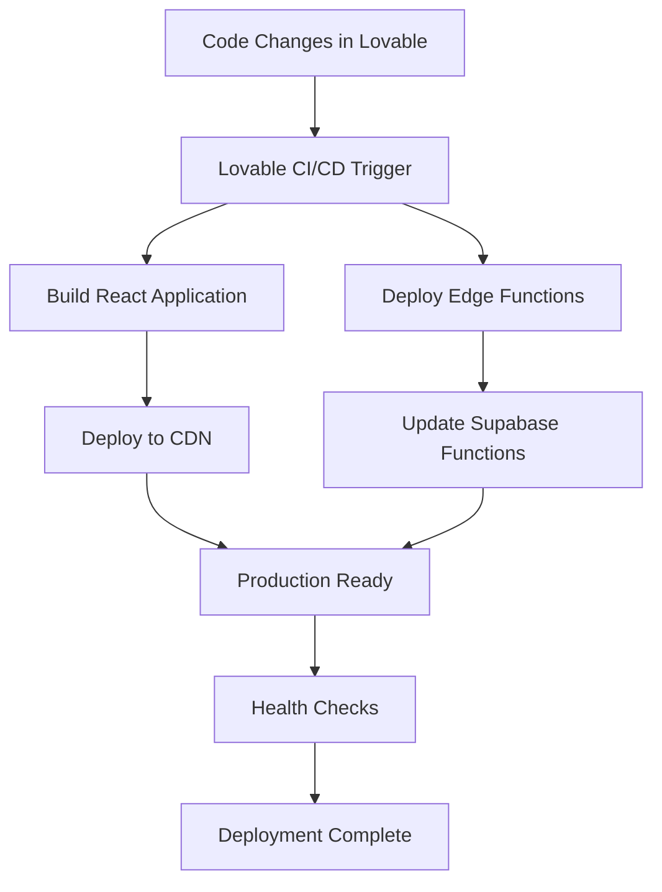

# WorkOrderPro Deployment Guide

## Overview

WorkOrderPro uses automated deployment through Lovable's integration with Supabase. This guide covers production deployment procedures, environment configuration, and maintenance workflows for the live workorderportal.com application.

## Production Configuration

### Domain Setup
- **Production URL**: https://workorderportal.com
- **Domain Provider**: IONOS
- **SSL Certificate**: Automatically managed by Lovable
- **DNS Configuration**: 
  - A records: @ and www → 185.158.133.1 (Lovable)
  - MX records: Configured for IONOS email
  - SPF record: `v=spf1 include:_spf-us.ionos.com -all`

### Email Configuration

#### IONOS Email Account
- **Email Address**: support@workorderportal.com
- **Purpose**: All system emails (automated notifications + support)
- **Provider**: IONOS Mail Basic
- **Daily Limit**: 1,000 emails

#### Supabase SMTP Integration
- **Configuration Location**: Supabase Dashboard → Authentication → SMTP Settings
- **Custom SMTP**: Enabled
- **Settings**:
  - Sender email: support@workorderportal.com
  - Sender name: AKC-WorkOrderPortal
  - SMTP Host: smtp.ionos.com
  - SMTP Port: 587
  - Authentication: Required

#### Email Rate Limits
- **Configured in**: Supabase Dashboard → Authentication → Rate Limits
- **Email sending**: 20 per hour
- **Token refresh**: 150 per 5 minutes

### Environment Configuration

This application uses Lovable's automatic environment configuration:
- **No .env files needed**
- **Supabase credentials**: Automatically injected by Lovable
- **SMTP settings**: Configured in Supabase Dashboard
- **All secrets**: Managed through platform integrations

## Deployment Architecture

### Automatic Deployment Process

WorkOrderPro uses **automatic deployment** triggered by code changes:



**Deployment Triggers:**
- Code changes in Lovable editor (automatic)
- Manual deployment via Lovable dashboard
- Preview deployments for testing

### Environment Management

**Production Environment:**
- **Frontend**: Lovable CDN deployment
- **Backend**: Supabase hosted PostgreSQL
- **Edge Functions**: Supabase Edge Runtime
- **Storage**: Supabase Storage buckets
- **Email**: IONOS SMTP via Supabase Auth

**Environment Variables:**
All secrets are managed through Supabase and Lovable:
```bash
# Auto-managed by Lovable
SUPABASE_URL                   # Database connection
SUPABASE_ANON_KEY             # Public database access
SUPABASE_SERVICE_ROLE_KEY     # Administrative access
```

## Production Deployment Checklist

### Pre-Deployment Verification

**✅ Database Readiness**
- [ ] All migrations applied successfully
- [ ] RLS policies tested and verified
- [ ] Performance indexes in place
- [ ] Audit triggers enabled

**✅ Edge Function Configuration**
- [ ] All 6 email functions deployed
- [ ] Email templates configured
- [ ] Database triggers active
- [ ] Error handling implemented

**✅ Email System**
- [ ] IONOS SMTP configured in Supabase
- [ ] SPF record verified
- [ ] Rate limits configured
- [ ] Test emails delivered successfully

**✅ Security Configuration**
- [ ] Service role key secured
- [ ] API keys rotated if needed
- [ ] CORS settings verified
- [ ] RLS policies enforce data isolation

### Edge Function Deployment

#### Automatic Deployment

Edge Functions are deployed automatically when code is changed in Lovable:

```typescript
// supabase/functions/ structure
functions/
├── email-work-order-created/
│   └── index.ts              # Work order creation notifications
├── email-work-order-assigned/
│   └── index.ts              # Assignment notifications
├── email-work-order-completed/
│   └── index.ts              # Completion notifications
├── email-report-submitted/
│   └── index.ts              # Report submission notifications
├── email-report-reviewed/
│   └── index.ts              # Report review notifications
├── email-welcome/
│   └── index.ts              # Welcome email for new users
├── setup-test-environment/
│   └── index.ts              # Database seeding
└── clear-test-data/
    └── index.ts              # Test data cleanup
```

#### Function Monitoring

**Version Management:**
- Functions are versioned automatically
- Rollback capability through Supabase dashboard
- Zero downtime deployment

**Function Health Checks:**
```bash
# Monitor function performance via Supabase Dashboard
# Check specific function health at:
# https://supabase.com/dashboard/project/inudoymofztrvxhrlrek/functions
```

### Monitoring Production

#### Email Monitoring
- **Application Logs**: `/admin/email-logs`
- **Supabase Logs**: Dashboard → Logs → Auth
- **Delivery Issues**: Check spam folders, verify SPF record
- **Test Panel**: `/admin/email-test` for function testing

#### Function Monitoring
- **Edge Function logs**: Supabase Dashboard → Functions → Logs
- **Database triggers**: Monitor `audit_logs` table
- **Email delivery**: Track via `email_logs` table

#### Health Check Endpoints

**Application Health:**
```typescript
// Health check through email test panel
const emailTest = async () => {
  const response = await fetch('/admin/email-test');
  return response.status === 200;
};
```

**Database Health:**
```sql
-- Connection test
SELECT 1;

-- Email system check
SELECT count(*) FROM email_templates WHERE is_active = true;

-- Recent activity check
SELECT count(*) FROM work_orders WHERE created_at > now() - interval '24 hours';
```

### Security Configuration

#### Service Role Management

**Service Role Key Usage:**
- Used exclusively in Edge Functions
- Never exposed to frontend code
- Automatically managed by Lovable

**SMTP Security:**
- Credentials stored securely in Supabase Dashboard
- TLS/SSL encryption for all email transmission
- Regular monitoring of email delivery logs

#### RLS Policy Verification

**Production RLS Testing:**
```sql
-- Test admin access
SELECT public.auth_is_admin();

-- Verify organization access
SELECT * FROM public.auth_user_organizations();

-- Test work order access
SELECT count(*) FROM work_orders;
```

### Database Configuration

#### Connection Pooling

**Supabase Pooler Configuration:**
- Connection pooling enabled automatically
- Pool mode: Session (default)
- Max connections: 100 (production tier)

#### Performance Optimization

**Critical Indexes:**
```sql
-- Work order performance
CREATE INDEX CONCURRENTLY idx_work_orders_status_org ON work_orders(status, organization_id);
CREATE INDEX CONCURRENTLY idx_work_orders_assigned ON work_orders(assigned_to, status);

-- User organization lookups
CREATE INDEX CONCURRENTLY idx_user_org_active ON user_organizations(user_id, organization_id);

-- Email logs performance
CREATE INDEX CONCURRENTLY idx_email_logs_work_order ON email_logs(work_order_id, sent_at);
```

### Rollback Procedures

#### Code Rollback via Lovable

**Automatic Rollback:**
1. Access Lovable project history
2. Select previous stable version
3. Deploy rollback version
4. Verify application operation

#### Database Rollback

**Schema Rollback:**
- Use Supabase Dashboard migration history
- Point-in-time recovery available
- Manual data restoration from backups

### Backup and Recovery

#### Automated Backups

**Supabase Automatic Backups:**
- Daily automated backups (7-day retention)
- Point-in-time recovery (7 days)
- Cross-region backup replication

#### Email System Backup

**Template Backup:**
- Email templates stored in database
- Included in automatic Supabase backups
- Supabase Auth templates backed up separately

### Maintenance Procedures

#### Regular Maintenance Tasks

**Weekly:**
- [ ] Review email delivery logs at `/admin/email-logs`
- [ ] Monitor Edge Function performance
- [ ] Check email rate limit usage
- [ ] Verify domain and SSL certificate status

**Monthly:**
- [ ] Review email template effectiveness
- [ ] Analyze email delivery success rates
- [ ] Update any changed IONOS configurations
- [ ] Test disaster recovery procedures

**Quarterly:**
- [ ] Full security audit
- [ ] Performance optimization review
- [ ] Email system load testing
- [ ] Documentation updates

#### Performance Optimization

**Database Optimization:**
```sql
-- Analyze table statistics
ANALYZE;

-- Monitor email performance
SELECT template_used, avg(delivered_at - sent_at) as avg_delivery_time
FROM email_logs 
WHERE delivered_at IS NOT NULL
GROUP BY template_used;
```

**Email System Optimization:**
- Monitor IONOS daily limits
- Optimize email template content
- Review and adjust rate limits
- Track bounce and delivery rates

This deployment guide ensures reliable, secure, and maintainable production deployments of WorkOrderPro at workorderportal.com while providing clear procedures for monitoring, maintenance, and incident response with IONOS email integration.
