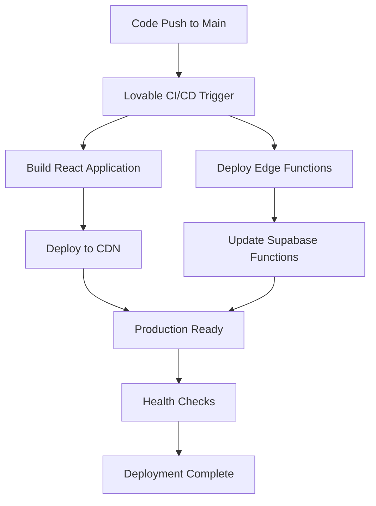

# WorkOrderPortal Deployment Guide

## Overview

WorkOrderPortal uses automated Edge Function deployment through Lovable's integration with Supabase. This guide covers production deployment procedures, environment configuration, and maintenance workflows.

## Deployment Architecture

### Automatic Deployment Process

WorkOrderPortal uses **automatic deployment** triggered by code changes:



**Deployment Triggers:**
- Push to main branch (automatic)
- Manual deployment via Lovable dashboard
- Preview deployments for feature branches

### Environment Management

**Production Environment:**
- **Frontend**: Lovable CDN deployment
- **Backend**: Supabase hosted PostgreSQL
- **Edge Functions**: Supabase Edge Runtime
- **Storage**: Supabase Storage buckets
- **Email**: Supabase Auth handles email communications directly

**Environment Variables:**
All secrets are managed through Supabase Edge Function secrets:
```bash
# Required Production Secrets

SUPABASE_URL                   # Database connection
SUPABASE_ANON_KEY             # Public database access
SUPABASE_SERVICE_ROLE_KEY     # Administrative access
SUPABASE_DB_URL               # Direct database connection
```

## Production Deployment Checklist

### Pre-Deployment Verification

**✅ Database Readiness**
- [ ] All migrations applied successfully
- [ ] RLS policies tested and verified
- [ ] Performance indexes in place
- [ ] Audit triggers enabled

**✅ Edge Function Configuration**
- [ ] All required secrets configured
- [ ] Function deployment successful
- [ ] Error handling implemented
- [ ] Logging configured for monitoring

**✅ Security Configuration**
- [ ] Service role key secured
- [ ] API keys rotated if needed
- [ ] CORS settings verified
- [ ] RLS policies enforce data isolation


### Edge Function Deployment

#### Automatic Deployment

Edge Functions are deployed automatically when code is pushed to the main branch:

```typescript
// supabase/functions/ structure
functions/
├── seed-database/
│   └── index.ts              # Database seeding
├── clear-test-data/
│   └── index.ts              # Test data cleanup
├── email-work-order-created/
│   └── index.ts              # Work order notifications
├── email-work-order-assigned/
│   └── index.ts              # Assignment notifications
└── _shared/
    ├── cors.ts               # CORS utilities
    ├── types.ts              # Shared type definitions
    └── seed-data.ts          # Test data definitions
```

#### Function Versioning

**Version Management:**
- Functions are versioned automatically
- Rollback capability through Supabase dashboard
- Blue-green deployment pattern for zero downtime

**Function Monitoring:**
```bash
# Monitor function performance
supabase functions logs --follow

# Check specific function health
curl -X POST 'https://inudoymofztrvxhrlrek.supabase.co/functions/v1/seed-database' \
  -H 'Content-Type: application/json' \
  -d '{"admin_key": "test"}'
```

### Security Configuration

#### Service Role Management

**Service Role Key Usage:**
- Used exclusively in Edge Functions
- Never exposed to frontend code
- Rotated regularly (quarterly recommended)

**Key Rotation Process:**
1. Generate new service role key in Supabase dashboard
2. Update Edge Function secrets: `supabase secrets set SUPABASE_SERVICE_ROLE_KEY=new_key`
3. Deploy updated functions
4. Verify function operation
5. Revoke old key

#### RLS Policy Verification

**Production RLS Testing:**
```sql
-- Test admin access
SELECT public.auth_is_admin();

-- Verify organization access
SELECT * FROM public.auth_user_organizations();

-- Test work order access
SELECT count(*) FROM work_orders;
```

### Database Configuration

#### Connection Pooling

**Supabase Pooler Configuration:**
- Connection pooling enabled automatically
- Pool mode: Session (default)
- Max connections: 100 (production tier)

#### Performance Optimization

**Critical Indexes:**
```sql
-- Work order performance
CREATE INDEX CONCURRENTLY idx_work_orders_status_org ON work_orders(status, organization_id);
CREATE INDEX CONCURRENTLY idx_work_orders_assigned ON work_orders(assigned_to, status);

-- User organization lookups
CREATE INDEX CONCURRENTLY idx_user_org_active ON user_organizations(user_id, organization_id);

-- Report filtering
CREATE INDEX CONCURRENTLY idx_reports_status ON work_order_reports(status, submitted_at);
```

## Production Configuration

### Environment Setup

**Supabase Project Configuration:**
```toml
# supabase/config.toml
project_id = "inudoymofztrvxhrlrek"

[auth]
enabled = true
external_email_enabled = true
external_phone_enabled = false

[db]
major_version = 15

[functions]
verify_jwt = true  # Default for all functions

[functions.seed-database]
verify_jwt = true  # Admin authentication required

[functions.clear-test-data]  
verify_jwt = true  # Admin authentication required
```

### Performance Considerations

**Database Performance:**
- Row Level Security adds query overhead
- Use materialized views for analytics
- Monitor slow queries via Supabase dashboard

**Edge Function Performance:**
- Functions have 60-second timeout
- Memory limit: 512MB per function
- Cold start latency: ~100-300ms

**Frontend Performance:**
- Vite build optimization enabled
- Code splitting for large components
- Service worker for offline capabilities

### Monitoring and Alerting

#### Health Check Endpoints

**Application Health:**
```typescript
// Health check through Edge Function
const healthCheck = async () => {
  const response = await fetch(
    'https://inudoymofztrvxhrlrek.supabase.co/functions/v1/seed-database',
    {
      method: 'POST',
      headers: { 'Content-Type': 'application/json' },
      body: JSON.stringify({ admin_key: 'health-check' })
    }
  );
  return response.status === 200;
};
```

**Database Health:**
```sql
-- Connection test
SELECT 1;

-- Performance check
SELECT count(*) FROM work_orders WHERE created_at > now() - interval '24 hours';
```

#### Log Monitoring

**Edge Function Logs:**
```bash
# Monitor all function logs
supabase functions logs --follow

# Filter by function
supabase functions logs seed-database

# Search for errors
supabase functions logs --filter "ERROR"
```

**Database Logs:**
- Access via Supabase dashboard
- Monitor slow queries (>1000ms)
- Track RLS policy violations
- Monitor connection pool usage

### Rollback Procedures

#### Edge Function Rollback

**Manual Rollback:**
1. Access Supabase Functions dashboard
2. Navigate to function version history
3. Select previous stable version
4. Deploy rollback version
5. Verify function operation

**Code-Based Rollback:**
```bash
# Revert to previous commit
git revert HEAD

# Force deployment
git push origin main --force
```

#### Database Rollback

**Schema Rollback:**
```sql
-- Use migration rollback (if supported)
-- Or manual schema restoration

-- Example: Rollback table changes
DROP TABLE IF EXISTS new_table_name;
ALTER TABLE old_table_name RENAME TO new_table_name;
```

**Data Rollback:**
- Point-in-time recovery through Supabase dashboard
- Manual data restoration from backups
- Use audit logs to track changes

### Backup and Recovery

#### Automated Backups

**Supabase Automatic Backups:**
- Daily automated backups (7-day retention)
- Point-in-time recovery (7 days)
- Cross-region backup replication

#### Manual Backup Procedures

**Database Backup:**
```bash
# Full database dump
supabase db dump > backup_$(date +%Y%m%d).sql

# Schema only
supabase db dump --schema-only > schema_backup.sql

# Data only
supabase db dump --data-only > data_backup.sql
```

**Function Backup:**
```bash
# Download all function code
git clone <repository_url>
tar -czf functions_backup_$(date +%Y%m%d).tar.gz supabase/functions/
```

### Security Hardening

#### API Security

**Rate Limiting:**
- Implemented at Supabase level
- 1000 requests/minute per IP
- Edge Function rate limiting: 100 requests/minute

**CORS Configuration:**
```typescript
const corsHeaders = {
  'Access-Control-Allow-Origin': '*',
  'Access-Control-Allow-Headers': 'authorization, x-client-info, apikey, content-type',
  'Access-Control-Allow-Methods': 'POST, OPTIONS'
};
```

#### Data Security

**Encryption:**
- All data encrypted at rest (Supabase default)
- TLS 1.3 for data in transit
- Database connection encryption

**Access Control:**
- Row Level Security enforced on all tables
- Service role limited to Edge Functions
- Regular access audit reviews

### Maintenance Procedures

#### Regular Maintenance Tasks

**Weekly:**
- [ ] Review Edge Function logs for errors
- [ ] Monitor database performance metrics
- [ ] Check email delivery success rates
- [ ] Verify backup completion

**Monthly:**
- [ ] Update dependencies (`npm audit`)
- [ ] Review and rotate API keys
- [ ] Analyze performance metrics
- [ ] Test disaster recovery procedures

**Quarterly:**
- [ ] Full security audit
- [ ] Service role key rotation
- [ ] Performance optimization review
- [ ] Documentation updates

#### Performance Optimization

**Database Optimization:**
```sql
-- Analyze table statistics
ANALYZE;

-- Vacuum full (maintenance window required)
VACUUM FULL;

-- Reindex for performance
REINDEX DATABASE postgres;
```

**Function Optimization:**
- Monitor cold start times
- Optimize function memory usage
- Review function duration metrics
- Implement connection pooling

This deployment guide ensures reliable, secure, and maintainable production deployments of WorkOrderPortal while providing clear procedures for monitoring, maintenance, and incident response.
