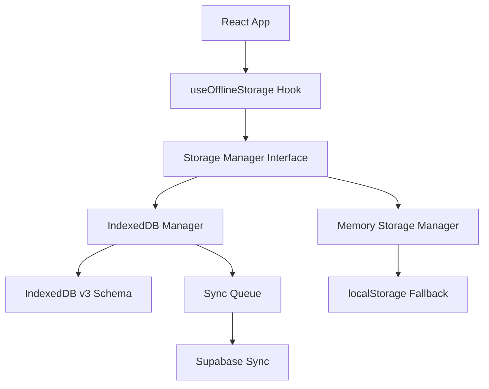

# WorkOrderPro Offline Storage Guide

## Table of Contents
1. [Introduction and Architecture](#introduction-and-architecture)
2. [IndexedDB Schema](#indexeddb-schema)
3. [Storage Manager Interface](#storage-manager-interface)
4. [Error Handling and Recovery](#error-handling-and-recovery)
5. [Testing and Debugging](#testing-and-debugging)
6. [Browser Compatibility](#browser-compatibility)
7. [Performance Optimization](#performance-optimization)
8. [Development Workflow](#development-workflow)
9. [Integration and Cross-References](#integration-and-cross-references)

## Introduction and Architecture

WorkOrderPro implements an **offline-first architecture** that allows subcontractors to continue working even without internet connectivity. The system provides seamless data synchronization when connectivity is restored.

### Core Components



### Architecture Benefits
- **Offline-first**: Core functionality works without internet
- **Progressive enhancement**: Enhanced features when online
- **Automatic sync**: Seamless data synchronization
- **Cross-browser**: Works across all modern browsers with fallbacks
- **Performance**: Local-first operations with background sync

## IndexedDB Schema

### Current Schema (v3)

WorkOrderPro uses IndexedDB v3 with 4 object stores:

```typescript
// Database: WorkOrderProDB (version 3)
const SCHEMA = {
  drafts: {
    keyPath: 'id',
    indexes: [
      { name: 'workOrderId', keyPath: 'workOrderId', unique: false },
      { name: 'updatedAt', keyPath: 'updatedAt', unique: false },
      { name: 'isManual', keyPath: 'metadata.isManual', unique: false }
    ]
  },
  attachments: {
    keyPath: 'id',
    indexes: [
      { name: 'draftId', keyPath: 'draftId', unique: false },
      { name: 'createdAt', keyPath: 'createdAt', unique: false }
    ]
  },
  syncQueue: {
    keyPath: 'id',
    indexes: [
      { name: 'createdAt', keyPath: 'createdAt', unique: false },
      { name: 'priority', keyPath: 'priority', unique: false }
    ]
  },
  metadata: {
    keyPath: 'key',
    indexes: [
      { name: 'category', keyPath: 'category', unique: false }
    ]
  }
};
```

### Data Structures

#### Draft Object
```typescript
interface ReportDraft {
  id: string;
  workOrderId: string;
  workPerformed: string;
  materialsUsed?: string;
  hoursWorked?: number;
  invoiceAmount?: number;
  invoiceNumber?: string;
  notes?: string;
  photos: PhotoAttachment[];
  metadata: {
    id: string;
    workOrderId: string;
    lastModified: number;
    version: number;
    autoSaveCount: number;
    isManual: boolean;
    deviceInfo?: {
      userAgent: string;
      timestamp: number;
    };
  };
  createdAt: number;
  updatedAt: number;
}
```

#### Photo Attachment
```typescript
interface PhotoAttachment {
  id: string;
  file: File;
  preview: string;
  compressed?: boolean;
  originalSize?: number;
  compressedSize?: number;
}
```

### Schema Evolution History

See [MIGRATION_HISTORY.md#indexeddb-storage-implementation](./MIGRATION_HISTORY.md#2025-01-11-indexeddb-storage-implementation) for complete version history:

- **v1**: Basic draft storage
- **v2**: Added attachments, sync queue, metadata stores
- **v3**: Fixed index errors, Safari compatibility (**Current**)

## Storage Manager Interface

### Core Interface

```typescript
interface StorageManager {
  // Draft operations
  saveDraft(draft: ReportDraft): Promise<void>;
  getDraft(id: string): Promise<ReportDraft | null>;
  getDraftsByWorkOrder(workOrderId: string): Promise<ReportDraft[]>;
  deleteDraft(id: string): Promise<void>;
  
  // Sync operations
  addToSyncQueue(item: SyncQueueItem): Promise<void>;
  getSyncQueue(): Promise<SyncQueueItem[]>;
  removeSyncQueueItem(id: string): Promise<void>;
  
  // Utility operations
  getStorageStats(): Promise<StorageStats>;
  exportData(): Promise<ExportData>;
  importData(data: ExportData): Promise<void>;
  cleanup(): Promise<void>;
  
  // Health monitoring
  verifyDatabaseIntegrity(): Promise<DatabaseIntegrityReport>;
  repairDatabase(strategies?: RepairStrategy[]): Promise<RepairResult>;
}
```

### Implementation Classes

#### IndexedDBManager (Primary)
```typescript
// Singleton pattern implementation
const indexedDBManager = IndexedDBManager.getInstance();

// Usage example
await indexedDBManager.init();
const draft = await indexedDBManager.saveDraft(draftData);
```

#### MemoryStorageManager (Fallback)
```typescript
// Automatic fallback for unsupported browsers
const memoryStorageManager = new MemoryStorageManager();
await memoryStorageManager.init(); // Uses localStorage
```

### React Hook Integration

```typescript
// Primary hook for offline storage
const {
  isReady,
  saveDraft,
  getDrafts,
  loadDraft,
  deleteDraft,
  storageStats,
  isUsingFallback
} = useOfflineStorage();

// Usage in components
const handleSaveDraft = async () => {
  if (!isReady) return;
  
  try {
    const draftId = await saveDraft(workOrderId, formData, photos);
    toast({ title: "Draft saved successfully" });
  } catch (error) {
    toast({ title: "Failed to save draft", variant: "destructive" });
  }
};
```

## Error Handling and Recovery

### Error Classification System

```typescript
type StorageError = {
  type: 'VersionError' | 'QuotaError' | 'CorruptionError' | 'SecurityError' | 'UnknownError';
  message: string;
  recoverable: boolean;
};
```

### Common Error Scenarios

#### 1. Version Conflicts
```typescript
// Error: Database version mismatch
// Solution: Automatic migration or reset
if (error.message.includes('version')) {
  await indexedDB.deleteDatabase('WorkOrderProDB');
  await initializeStorageWithRetry();
}
```

#### 2. Storage Quota Exceeded
```typescript
// Error: QuotaExceededError
// Solution: Automatic cleanup
if (error.name === 'QuotaExceededError') {
  await storageManager.cleanup();
  await retryOperation();
}
```

#### 3. Index Access Errors (Fixed in v3)
```typescript
// Previous error: "DOMException: Index not found"
// Solution: Complete schema recreation
const createCompleteSchema = (db: IDBDatabase) => {
  // Creates all stores and indexes in single transaction
  const stores = ['drafts', 'attachments', 'syncQueue', 'metadata'];
  stores.forEach(storeName => {
    if (!db.objectStoreNames.contains(storeName)) {
      const store = db.createObjectStore(storeName, { keyPath: 'id' });
      // Add indexes immediately
    }
  });
};
```

### Automatic Fallback Strategy

```typescript
// Initialization with retry and fallback
const initializeStorage = async () => {
  try {
    await indexedDBManager.init();
    setStorageManager(indexedDBManager);
  } catch (error) {
    console.warn('IndexedDB failed, falling back to memory storage');
    await memoryStorageManager.init();
    setStorageManager(memoryStorageManager);
    setIsUsingFallback(true);
  }
};
```

## Testing and Debugging

### Console Debug Utilities

WorkOrderPro includes comprehensive debug utilities available in development:

```javascript
// Run comprehensive storage tests
window.__testStorage()

// Check storage health
window.__storageHealth()

// View storage statistics
window.__storageStats()

// Get migration information
window.__storageMigration()

// Reset all storage (DESTRUCTIVE)
window.__resetStorage()
```

### Testing Storage Functionality

#### 1. Basic CRUD Test
```javascript
const runBasicTest = async () => {
  const testDraft = {
    id: 'test-draft-' + Date.now(),
    workOrderId: 'test-wo-123',
    workPerformed: 'Test work performed',
    photos: [],
    metadata: {
      id: 'test-meta',
      workOrderId: 'test-wo-123',
      lastModified: Date.now(),
      version: 1,
      autoSaveCount: 0,
      isManual: true,
    },
    createdAt: Date.now(),
    updatedAt: Date.now(),
  };

  // Test Create
  await storageManager.saveDraft(testDraft);
  
  // Test Read
  const retrieved = await storageManager.getDraft(testDraft.id);
  console.assert(retrieved !== null, 'Draft should be retrieved');
  
  // Test Update
  testDraft.workPerformed = 'Updated work';
  await storageManager.saveDraft(testDraft);
  
  // Test Delete
  await storageManager.deleteDraft(testDraft.id);
  
  console.log('✅ Basic CRUD test passed');
};
```

#### 2. Offline Simulation
```javascript
// Simulate offline conditions
navigator.serviceWorker.ready.then(registration => {
  // Test offline functionality
  window.addEventListener('online', () => {
    console.log('Back online - triggering sync');
    processPendingSyncs();
  });
});
```

### Browser DevTools Debugging

#### 1. IndexedDB Inspector
1. Open DevTools → Application Tab
2. Navigate to Storage → IndexedDB → WorkOrderProDB
3. Inspect object stores: `drafts`, `attachments`, `syncQueue`, `metadata`
4. View indexes and data

#### 2. Performance Monitoring
```javascript
// Monitor storage performance
console.time('draft-save');
await storageManager.saveDraft(draft);
console.timeEnd('draft-save');

// Check storage usage
const stats = await storageManager.getStorageStats();
console.log('Storage usage:', stats.usedSpace / stats.totalSpace * 100 + '%');
```

#### 3. Network Tab Analysis
- Monitor sync operations to Supabase
- Check for failed uploads
- Analyze retry patterns

## Browser Compatibility

### IndexedDB Support Matrix

| Browser | Version | IndexedDB | Transactions | Large Objects | Notes |
|---------|---------|-----------|--------------|---------------|-------|
| Chrome | 58+ | ✅ Full | ✅ | ✅ | Best performance |
| Firefox | 55+ | ✅ Full | ✅ | ✅ | Excellent support |
| Safari | 10+ | ⚠️ Limited | ⚠️ Basic | ❌ | Memory fallback recommended |
| Edge | 79+ | ✅ Full | ✅ | ✅ | Chromium-based |
| iOS Safari | 10+ | ⚠️ Limited | ⚠️ Basic | ❌ | 50MB limit |
| Android | 58+ | ✅ Full | ✅ | ✅ | Chrome-based |

### Safari-Specific Handling

```typescript
// Safari fallback initialization
const initSafariFallback = (): Promise<void> => {
  return new Promise((resolve, reject) => {
    const request = indexedDB.open(this.dbName);
    
    request.onerror = () => reject(request.error);
    request.onsuccess = () => {
      this.db = request.result;
      resolve();
    };
    
    request.onupgradeneeded = (event) => {
      const db = (event.target as IDBOpenDBRequest).result;
      // Create schema without version enforcement
      createCompleteSchema(db);
    };
  });
};
```

### Feature Detection

```typescript
// Check IndexedDB availability
const isIndexedDBAvailable = (): boolean => {
  return !!(
    typeof window !== 'undefined' &&
    window.indexedDB &&
    window.IDBTransaction &&
    window.IDBKeyRange
  );
};

// Check storage quota
const checkStorageQuota = async (): Promise<number> => {
  if ('storage' in navigator && 'estimate' in navigator.storage) {
    const estimate = await navigator.storage.estimate();
    return estimate.quota || 0;
  }
  return 0;
};
```

## Performance Optimization

### Storage Quotas and Limits

```typescript
const STORAGE_LIMITS = {
  maxDraftsPerWorkOrder: 5,
  maxTotalDrafts: 50,
  maxPhotoSizeBytes: 5 * 1024 * 1024, // 5MB
  maxTotalStorageBytes: 50 * 1024 * 1024, // 50MB
  compressionQuality: 0.8,
  cleanupThresholdDays: 30,
};
```

### Photo Compression

```typescript
// Automatic photo compression
const compressPhoto = async (file: File): Promise<File> => {
  if (file.size <= 1024 * 1024) return file; // Skip if < 1MB
  
  const canvas = document.createElement('canvas');
  const ctx = canvas.getContext('2d');
  const img = await createImageBitmap(file);
  
  // Calculate new dimensions
  const maxSize = 1920;
  const ratio = Math.min(maxSize / img.width, maxSize / img.height);
  
  canvas.width = img.width * ratio;
  canvas.height = img.height * ratio;
  
  ctx.drawImage(img, 0, 0, canvas.width, canvas.height);
  
  return new Promise(resolve => {
    canvas.toBlob(resolve, 'image/jpeg', 0.8);
  });
};
```

### Cleanup Strategies

```typescript
// Automatic cleanup implementation
const enforceStorageLimits = async (): Promise<void> => {
  const stats = await getStorageStats();
  
  // Clean up old drafts if over limit
  if (stats.draftCount > STORAGE_LIMITS.maxTotalDrafts) {
    const oldDrafts = await getOldestDrafts(
      stats.draftCount - STORAGE_LIMITS.maxTotalDrafts
    );
    await Promise.all(oldDrafts.map(draft => deleteDraft(draft.id)));
  }
  
  // Clean up large attachments
  if (stats.usedSpace > STORAGE_LIMITS.maxTotalStorageBytes * 0.9) {
    await cleanupLargeAttachments();
  }
};
```

### Sync Queue Optimization

```typescript
// Prioritized sync queue
interface SyncQueueItem {
  id: string;
  type: 'draft' | 'photo' | 'report';
  priority: number; // Higher = more important
  data: any;
  retryCount: number;
  lastAttempt?: number;
  createdAt: number;
}

// Process queue by priority
const processSyncQueue = async (): Promise<void> => {
  const queue = await getSyncQueue();
  const sortedQueue = queue.sort((a, b) => b.priority - a.priority);
  
  for (const item of sortedQueue) {
    try {
      await syncItemToServer(item);
      await removeSyncQueueItem(item.id);
    } catch (error) {
      await incrementRetryCount(item.id);
    }
  }
};
```

## Development Workflow

### Setting Up Offline Testing

#### 1. Enable Offline Mode
```javascript
// In DevTools Console
// Disable network
navigator.serviceWorker.ready.then(() => {
  // Simulate offline
  window.dispatchEvent(new Event('offline'));
});

// Or use DevTools Network tab → Offline checkbox
```

#### 2. Test Draft Functionality
```typescript
// Test offline draft saving
const testOfflineDrafts = async () => {
  // Go offline
  window.dispatchEvent(new Event('offline'));
  
  // Create draft
  const draftId = await saveDraft('test-wo-123', {
    workPerformed: 'Offline test work',
    invoiceAmount: 150.00
  }, []);
  
  // Verify draft saved locally
  const drafts = await getDrafts('test-wo-123');
  console.assert(drafts.length > 0, 'Draft should be saved offline');
  
  // Go online and verify sync
  window.dispatchEvent(new Event('online'));
  await processPendingSyncs();
};
```

#### 3. Monitor Storage Health
```typescript
// Regular health checks
setInterval(async () => {
  const health = await storageManager.getHealthStatus();
  if (health.overallHealth !== 'healthy') {
    console.warn('Storage health issue:', health);
  }
}, 30000);
```

### Common Development Tasks

#### Adding New Data Types
```typescript
// 1. Update interface in types/offline.ts
interface NewDataType {
  id: string;
  // ... other fields
}

// 2. Add to storage manager interface
interface StorageManager {
  saveNewData(data: NewDataType): Promise<void>;
  getNewData(id: string): Promise<NewDataType | null>;
}

// 3. Implement in IndexedDBManager
// 4. Add to memory fallback
// 5. Update schema if needed
```

#### Debugging Sync Issues
```typescript
// Check sync queue
const debugSyncQueue = async () => {
  const queue = await storageManager.getSyncQueue();
  console.log('Pending sync items:', queue);
  
  queue.forEach(item => {
    console.log(`${item.type} - Priority: ${item.priority}, Retries: ${item.retryCount}`);
  });
};
```

## Integration and Cross-References

### Supabase Integration

The offline storage system integrates seamlessly with Supabase tables:

- **Local Drafts** → **work_order_reports** table
- **Local Attachments** → **work_order_attachments** table  
- **Sync Queue** → Background sync to Supabase
- **User Context** → RLS policies ensure data security

See [DATABASE_SCHEMA.md](./DATABASE_SCHEMA.md) for complete Supabase table definitions.

### Migration History

For complete change history of offline storage, see:
- [MIGRATION_HISTORY.md#indexeddb-storage-implementation](./MIGRATION_HISTORY.md#2025-01-11-indexeddb-storage-implementation)

### React Hook Integration

```typescript
// Primary integration points
import { useOfflineStorage } from '@/hooks/useOfflineStorage';
import { useDraftAutoSave } from '@/hooks/useDraftAutoSave';
import { useNetworkStatus } from '@/hooks/useNetworkStatus';

// Example component usage
const SubmitReport = () => {
  const { saveDraft, isReady, isUsingFallback } = useOfflineStorage();
  const { isOnline } = useNetworkStatus();
  
  return (
    <div>
      {isUsingFallback && (
        <Alert>Using temporary storage - data will sync when available</Alert>
      )}
      {/* Form components */}
    </div>
  );
};
```

### File Structure

```
src/
├── utils/indexedDB/
│   ├── index.ts           # Main exports and singleton
│   ├── manager.ts         # IndexedDBManager class
│   ├── operations.ts      # CRUD operations
│   ├── schema.ts          # Database schema and migrations  
│   ├── integrity.ts       # Health checking and repair
│   ├── cleanup.ts         # Storage maintenance
│   ├── debug.ts           # Development utilities
│   └── types.ts           # TypeScript interfaces
├── utils/memoryStorage.ts # Fallback implementation
├── hooks/
│   ├── useOfflineStorage.ts      # Main hook
│   ├── useStorageInitialization.ts
│   └── useDraftManagement.ts
└── types/offline.ts       # Shared type definitions
```

---

## Quick Reference

### Essential Commands
```javascript
// Test storage
await window.__testStorage()

// Check health  
await window.__storageHealth()

// View stats
await window.__storageStats()

// Reset storage (DESTRUCTIVE)
await window.__resetStorage()
```

### Key Metrics to Monitor
- Storage usage percentage
- Draft count per work order
- Sync queue size
- Error rates by browser
- Compression ratios

### Performance Targets
- Draft save: < 100ms
- Photo compression: < 2s
- Sync operation: < 5s
- Storage cleanup: < 1s

---

*This guide covers WorkOrderPro's offline storage system as of v3. For updates and changes, refer to the migration history and codebase documentation.*
