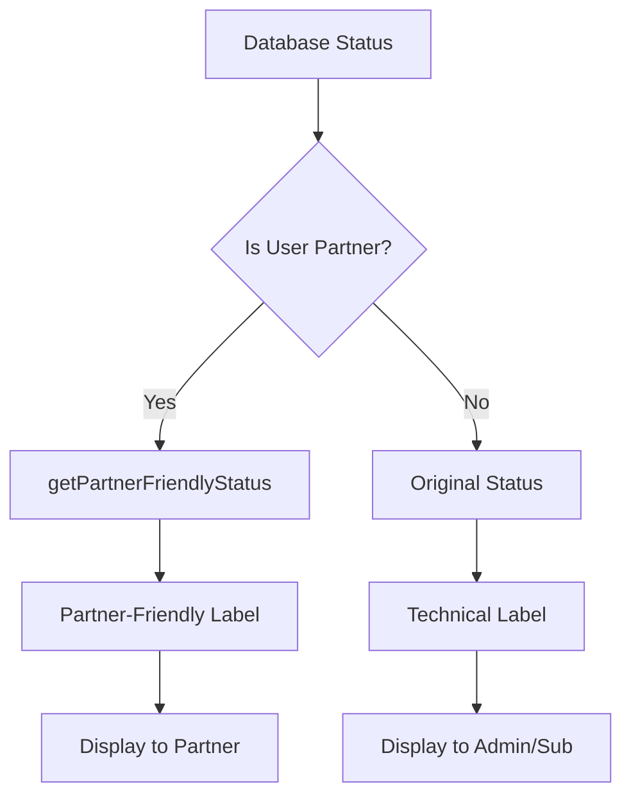

# Partner UX Improvements

## Overview

The WorkOrderPortal includes a comprehensive status translation system that provides partners with user-friendly status labels instead of technical database values. This improves the partner experience by using business language rather than system terminology.

## System Architecture

### Status Translation Flow



### Core Components

1. **Status Display Functions** (`src/lib/status-display.ts`)
   - `getPartnerFriendlyStatus()` - Translates statuses for partners
   - `getEstimateTabStatus()` - Manages estimate tab indicators

2. **Status Badge Component** (`src/components/ui/work-order-status-badge.tsx`)
   - Automatically detects user role
   - Applies appropriate status translation
   - Handles estimate indicators

3. **Activity Feed Integration** (`src/hooks/usePartnerSubcontractorActivityFeed.ts`)
   - Shows partner-friendly status changes in activity timeline
   - Maintains role-based visibility

## Implementation Guide

### Using WorkOrderStatusBadge

#### ✅ Correct Usage (Automatic Role Detection)
```tsx
import { WorkOrderStatusBadge } from '@/components/ui/work-order-status-badge';

// Component automatically detects if user is partner and applies translation
<WorkOrderStatusBadge 
  status={workOrder.status} 
  workOrder={workOrder}  // Required for estimate context
/>
```

#### ❌ Incorrect Usage
```tsx
// Missing workOrder prop - estimate indicators won't work
<WorkOrderStatusBadge status={workOrder.status} />

// Manual role checking - unnecessary complexity
{isPartner ? 
  <WorkOrderStatusBadge status={getPartnerFriendlyStatus(workOrder.status, workOrder)} /> :
  <WorkOrderStatusBadge status={workOrder.status} />
}
```

### Status Translation Examples

| Database Status | Admin/Subcontractor View | Partner View | Context |
|----------------|-------------------------|--------------|---------|
| `estimate_needed` | Estimate Needed | Preparing Estimate | No internal estimate yet |
| `estimate_needed` | Estimate Needed | Pending Your Approval | Internal estimate ready |
| `estimate_approved` | Estimate Approved | Approved - Ready to Start | Partner approved estimate |
| `received` | Received | New | Default mapping |
| `in_progress` | In Progress | In Progress | Default mapping |

### Estimate Tab Indicators

The system provides visual indicators for estimate status:

```typescript
// Returns null if no estimate exists
getEstimateTabStatus(workOrder) === null

// Returns badge configuration for pending approval
{
  showBadge: true,
  badgeVariant: 'warning',
  badgeText: 'Action Required',
  pulseAnimation: true
}

// Returns badge for approved estimate
{
  showBadge: true,
  badgeVariant: 'success', 
  badgeText: 'Approved',
  pulseAnimation: false
}
```

## Component Integration

### Affected Components

All components using work order status display have been updated:

1. **Activity Feeds**
   - `src/hooks/usePartnerSubcontractorActivityFeed.ts`
   - Shows partner-friendly status changes

2. **Status Badges**
   - `src/components/ui/work-order-status-badge.tsx`
   - Automatic role-based translation

3. **Dashboard Components**
   - `src/components/dashboard/StandardDashboardStats.tsx`
   - `src/components/mobile/OrganizationActivityCard.tsx`

4. **General Status Displays**
   - `src/components/ui/status-badge.tsx`

### Integration Requirements

When integrating status display in new components:

1. **Always pass workOrder object** when estimate context is needed
2. **Let WorkOrderStatusBadge handle role detection** automatically
3. **Use getPartnerFriendlyStatus directly** only for text-only displays
4. **Import from status-display.ts** for consistent translation

## Performance Optimization

### Memoization Strategy

The system uses React.useMemo for expensive operations:

```typescript
// In WorkOrderStatusBadge component
const partnerLabel = React.useMemo(() => 
  getPartnerFriendlyStatus(status, workOrder), 
  [status, workOrder?.internal_estimate_amount, workOrder?.partner_estimate_approved]
);

const estimateStatus = React.useMemo(() => 
  getEstimateTabStatus(workOrder), 
  [workOrder?.internal_estimate_amount, workOrder?.partner_estimate_approved]
);
```

### Bundle Size Impact

- **Minimal impact**: ~2KB additional code
- **Tree-shakable**: Functions not used are eliminated
- **Type-safe**: Full TypeScript support with zero runtime overhead

## Testing Strategy

### Unit Tests

Comprehensive test coverage in `src/lib/__tests__/status-display.test.ts`:

- ✅ 33 test cases covering all scenarios
- ✅ 100% function, branch, and line coverage
- ✅ Performance benchmarks (sub-millisecond execution)
- ✅ Type compatibility validation
- ✅ Edge case handling

### Manual Testing Scenarios

#### Partner User Testing
1. **Login as partner** and navigate to work orders
2. **Verify status labels** show partner-friendly text
3. **Check estimate tab** shows proper indicators
4. **Review activity feed** displays translated status changes

#### Admin/Subcontractor Testing  
1. **Login as admin or subcontractor**
2. **Verify status labels** show original technical terms
3. **Confirm activity feed** shows database status values
4. **Check estimate functionality** works for admins

#### Cross-Role Testing
1. **Same work order viewed by different roles** shows appropriate labels
2. **Status changes reflected correctly** in all user interfaces
3. **Estimate approvals trigger proper** badge updates

### Running Tests

```bash
# Run all tests
npm test

# Run with coverage
npm test -- --coverage

# Run in watch mode
npm test -- --watch

# Run specific test file
npm test status-display
```

## Troubleshooting Guide

### Common Issues

#### 1. Status Not Translating for Partners
**Symptoms**: Partners see technical status like "estimate_needed"
**Cause**: Missing workOrder prop or incorrect role detection
**Solution**: 
```tsx
// Ensure workOrder prop is passed
<WorkOrderStatusBadge status={status} workOrder={workOrder} />

// Check user role is correctly identified
const { isPartner } = useUserProfile();
console.log('Is partner:', isPartner);
```

#### 2. Estimate Tab Not Showing Badge
**Symptoms**: Estimate tab has no indicator despite pending approval
**Cause**: Missing estimate data or incorrect estimate status
**Solution**:
```typescript
// Verify estimate data exists
console.log('Internal estimate:', workOrder.internal_estimate_amount);
console.log('Partner approval:', workOrder.partner_estimate_approved);

// Check function return value
const tabStatus = getEstimateTabStatus(workOrder);
console.log('Tab status:', tabStatus);
```

#### 3. Activity Feed Shows Raw Statuses
**Symptoms**: Activity feed displays "estimate_needed → estimate_approved"  
**Cause**: Activity feed not using translation function
**Solution**: Fixed in `usePartnerSubcontractorActivityFeed.ts` - no action needed

#### 4. Type Errors with WorkOrder Object
**Symptoms**: TypeScript errors about missing properties
**Cause**: Using narrow work order type without estimate fields
**Solution**:
```typescript
// Use flexible interface that supports partial work orders
interface WorkOrderForStatus {
  internal_estimate_amount?: number | null;
  partner_estimate_approved?: boolean | null;
  subcontractor_estimate_amount?: number | null;
}
```

### Debug Mode

Enable debug logging for status translation:

```typescript
// Add to status-display.ts for debugging
const DEBUG = process.env.NODE_ENV === 'development';

export function getPartnerFriendlyStatus(status, workOrder) {
  if (DEBUG) {
    console.log('Status translation:', { status, workOrder, result: '...' });
  }
  // ... function logic
}
```

### Performance Issues

If status translation becomes a bottleneck:

1. **Check re-render frequency** - ensure proper memoization
2. **Verify workOrder stability** - object reference should be stable
3. **Profile component renders** using React DevTools
4. **Consider caching** for frequently accessed work orders

## Migration Guide

### From Previous Implementation

If upgrading from a previous status display system:

1. **Replace direct status display** with WorkOrderStatusBadge component
2. **Add workOrder prop** where estimate context is needed  
3. **Remove manual role checking** - component handles automatically
4. **Update tests** to account for partner-friendly labels

### Breaking Changes

None - the system is backward compatible:
- Existing status displays continue working
- New translation only applies when workOrder prop is provided
- Non-partner users see unchanged status labels

## Future Enhancements

### Planned Features

1. **Localization Support** - Multi-language status translations
2. **Custom Partner Labels** - Organization-specific terminology
3. **Status History** - Timeline of all status changes with translations
4. **Notification Templates** - Partner-friendly email content

### Extension Points

The system is designed for easy extension:

```typescript
// Add new status translations
const customStatusLabels: Record<WorkOrderStatus, string> = {
  'custom_status': 'Your Custom Label'
};

// Extend estimate logic
export function getCustomEstimateStatus(workOrder: WorkOrder) {
  // Custom estimate indicator logic
}
```

---

**Last Updated**: December 2024  
**Version**: 1.0.0  
**Related Documentation**: 
- [Testing Guide](./TESTING_GUIDE.md)
- [Component Architecture](./COMPONENT_ARCHITECTURE.md)
- [Database Schema](./DATABASE_SCHEMA.md)