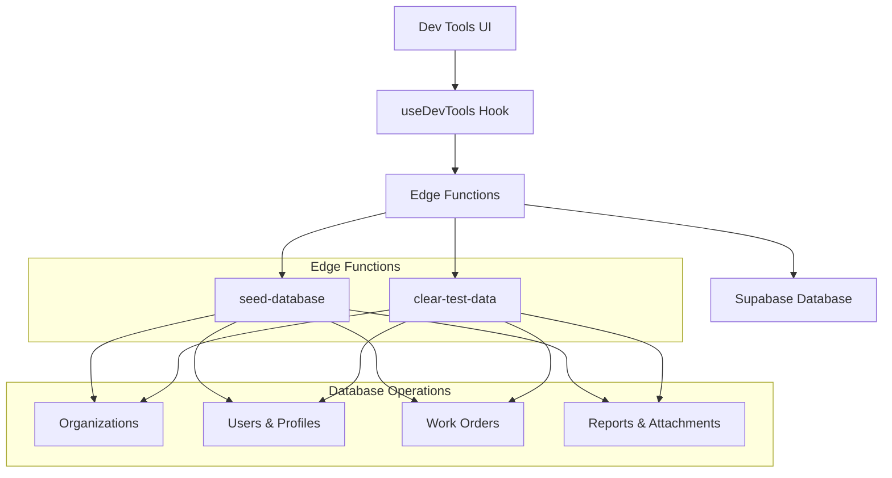

# Database Seeding Guide

## Overview

WorkOrderPro uses **Edge Function-based seeding** for secure, server-side database initialization. This approach replaces the old browser-based seeding system with a more robust, scalable solution.

## Why Edge Functions for Seeding?

### Security Benefits
- **Service Role Privileges**: Edge Functions run with elevated database permissions
- **RLS Bypass**: Can perform administrative operations that bypass Row Level Security
- **Server-Side Execution**: No browser security limitations or client-side vulnerabilities
- **Authentication Control**: Secure admin key validation before any operations

### Performance Advantages
- **Atomic Transactions**: Complete rollback on any failure
- **Bulk Operations**: Efficient batch processing for large datasets
- **No Browser Limits**: Can handle large datasets without memory constraints
- **Parallel Processing**: Concurrent operations for faster seeding

### Reliability Features
- **Comprehensive Error Handling**: Detailed error reporting and debugging
- **Dry-Run Mode**: Preview operations before execution
- **Progress Tracking**: Real-time feedback on seeding progress
- **Audit Trail**: Complete logging of all seeding operations

## Architecture Overview



## Available Edge Functions

### 1. `seed-database`
**Purpose**: Populate database with comprehensive test data

**Endpoint**: `/functions/v1/seed-database`

**Request Format**:
```json
{
  "admin_key": "dev-admin-key",
  "options": {
    "clear_existing": true,
    "include_test_data": true,
    "organization_count": 5,
    "user_count": 20,
    "work_order_count": 50
  }
}
```

**Response Format**:
```json
{
  "success": true,
  "progress": {
    "step": "Creating work orders",
    "completed": 45,
    "total": 50
  },
  "summary": {
    "total_records": 150,
    "organizations": 5,
    "users": 20,
    "work_orders": 50,
    "reports": 25,
    "attachments": 75
  },
  "execution_time_ms": 2341
}
```

### 2. `clear-test-data`
**Purpose**: Safely remove test data with dry-run support

**Endpoint**: `/functions/v1/clear-test-data`

**Request Format**:
```json
{
  "admin_key": "dev-admin-key",
  "dry_run": false,
  "confirm_deletion": true,
  "include_summary": true
}
```

**Response Format**:
```json
{
  "success": true,
  "deleted_counts": {
    "work_orders": 50,
    "work_order_reports": 25,
    "profiles": 20,
    "organizations": 5,
    "email_logs": 100
  },
  "test_data_summary": {
    "identified_test_users": 20,
    "identified_test_orgs": 5,
    "identified_test_work_orders": 50
  },
  "execution_time_ms": 1234
}
```

## How to Use Edge Function Seeding

### Local Development

1. **Access Dev Tools**: Navigate to `/dev-tools` in your application
2. **Seed Database**: Click "Seed Database" to populate with test data
3. **Clear Data**: Click "Clear Test Data" to remove test data
4. **Monitor Progress**: Watch console output for real-time feedback

### Programmatic Usage

```typescript
import { supabase } from '@/integrations/supabase/client';

// Seed the database
const seedDatabase = async () => {
  const { data, error } = await supabase.functions.invoke('seed-database', {
    body: {
      admin_key: 'dev-admin-key',
      options: {
        clear_existing: true,
        include_test_data: true
      }
    }
  });
  
  if (error) {
    console.error('Seeding failed:', error);
    return;
  }
  
  console.log('Seeding completed:', data.summary);
};

// Clear test data with dry-run
const clearTestData = async (dryRun = true) => {
  const { data, error } = await supabase.functions.invoke('clear-test-data', {
    body: {
      admin_key: 'dev-admin-key',
      dry_run: dryRun,
      confirm_deletion: !dryRun,
      include_summary: true
    }
  });
  
  if (error) {
    console.error('Clear operation failed:', error);
    return;
  }
  
  console.log('Clear operation result:', data.deleted_counts);
};
```

## Modifying Seed Data

### Organizations
Edit the organizations array in `supabase/functions/seed-database/index.ts`:

```typescript
const organizations = [
  {
    name: 'Your Company Name',
    contact_email: 'contact@yourcompany.com',
    contact_phone: '(555) 123-4567',
    organization_type: 'partner', // 'partner', 'subcontractor', 'internal'
    initials: 'YCN' // Used for work order numbering
  }
];
```

### Users
Modify the users array to add different user types:

```typescript
const users = [
  {
    email: 'admin@company.com',
    first_name: 'Admin',
    last_name: 'User',
    user_type: 'admin', // 'admin', 'employee', 'partner', 'subcontractor'
    organization_name: 'Your Company Name',
    is_employee: true // For admin/employee types
  }
];
```

### Work Orders
Customize work order generation parameters:

```typescript
const workOrderConfig = {
  count: 50,
  statusDistribution: {
    received: 0.2,
    assigned: 0.3,
    in_progress: 0.3,
    completed: 0.2
  },
  tradeDistribution: {
    'Plumbing': 0.3,
    'Electrical': 0.2,
    'HVAC': 0.2,
    'General Maintenance': 0.3
  }
};
```

## Error Handling

### Common Issues and Solutions

#### Authentication Errors
```
Error: Unauthorized access
```
**Solution**: Verify admin key is correct in dev environment

#### Network Errors
```
Error: FunctionsHttpError
```
**Solution**: Check internet connection and Supabase service status

#### Function Errors
```
Error: FunctionsFetchError
```
**Solution**: Review Edge Function logs in Supabase dashboard

#### Database Errors
```
Error: Foreign key constraint violation
```
**Solution**: Ensure clear_existing=true or run clear-test-data first

### Error Recovery

1. **Partial Seeding Failures**: Edge Functions use transactions - partial failures are automatically rolled back
2. **Network Interruptions**: Re-run the seeding operation - it's idempotent
3. **Data Conflicts**: Use clear-test-data first, then re-seed
4. **Permission Issues**: Verify admin key and Supabase project access

## Deployment Instructions

### Edge Function Deployment

Edge Functions are automatically deployed when you push changes to the repository. No manual deployment needed.

### Environment Variables

Set these in your Supabase project:
- `SUPABASE_URL`: Your project URL
- `SUPABASE_ANON_KEY`: Public anon key
- `SUPABASE_SERVICE_ROLE_KEY`: Service role key (for Edge Functions)

### Production Considerations

1. **Security**: Change admin keys for production environments
2. **Rate Limiting**: Implement rate limiting for seeding endpoints
3. **Monitoring**: Set up alerts for Edge Function failures
4. **Backup**: Always backup production data before seeding operations

## Troubleshooting Guide

### Debug Mode

Enable detailed logging in Edge Functions:

```typescript
const DEBUG = true; // Set to true for verbose logging

if (DEBUG) {
  console.log('Seeding step:', currentStep);
  console.log('Current progress:', progress);
}
```

### Console Output

Monitor seeding progress in browser console:

```
🌱 Starting database seeding via Edge Function...
📊 Seeding Progress: Creating organizations (5/5)
📊 Seeding Progress: Creating users (20/20) 
📊 Seeding Progress: Creating work orders (50/50)
✅ Database seeded successfully via Edge Function
📋 Summary: Created 150 total records
```

### Edge Function Logs

Access detailed logs in Supabase Dashboard:
1. Go to **Functions** section
2. Select the function (`seed-database` or `clear-test-data`)
3. Click **Logs** tab
4. Review execution details and error messages

### Performance Monitoring

Track seeding performance:

```typescript
const startTime = Date.now();
// ... seeding operations
const executionTime = Date.now() - startTime;
console.log(`Seeding completed in ${executionTime}ms`);
```

## Migration from Browser Seeding

### What Changed

**OLD APPROACH (Deprecated)**:
```typescript
// ❌ Browser-based seeding (removed)
import { seedDatabase } from '../scripts/enhanced-seed-functions';
await seedDatabase();
```

**NEW APPROACH (Current)**:
```typescript
// ✅ Edge Function seeding
const { data, error } = await supabase.functions.invoke('seed-database', {
  body: { admin_key: 'dev-admin-key' }
});
```

### Migration Benefits

1. **Security**: Server-side execution with proper authentication
2. **Reliability**: Atomic transactions with rollback support
3. **Performance**: No browser limitations or memory constraints
4. **Maintenance**: Centralized seeding logic on server
5. **Audit**: Complete logging and monitoring capabilities

### Breaking Changes

- **Removed Files**: `src/scripts/seed-functions.ts`, `src/scripts/enhanced-seed-functions.ts`
- **API Changes**: seeding now requires Edge Function calls
- **Authentication**: Admin key required for seeding operations
- **Error Handling**: New error response format from Edge Functions

## Best Practices

### Development Workflow

1. **Always Use Dry-Run**: Test clear operations before executing
2. **Monitor Progress**: Watch console output during seeding
3. **Verify Results**: Check data integrity after seeding
4. **Clean Environment**: Clear test data regularly to avoid conflicts

### Data Management

1. **Consistent Naming**: Use clear, consistent test data patterns
2. **Realistic Data**: Create data that mirrors production scenarios
3. **Proper Relationships**: Ensure foreign key integrity
4. **Balanced Distribution**: Realistic ratios of different data types

### Security Guidelines

1. **Secure Admin Keys**: Never commit production admin keys
2. **Environment-Specific**: Use different keys for dev/staging/prod
3. **Access Control**: Restrict seeding access to authorized personnel
4. **Audit Logging**: Monitor all seeding operations in production